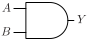
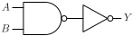
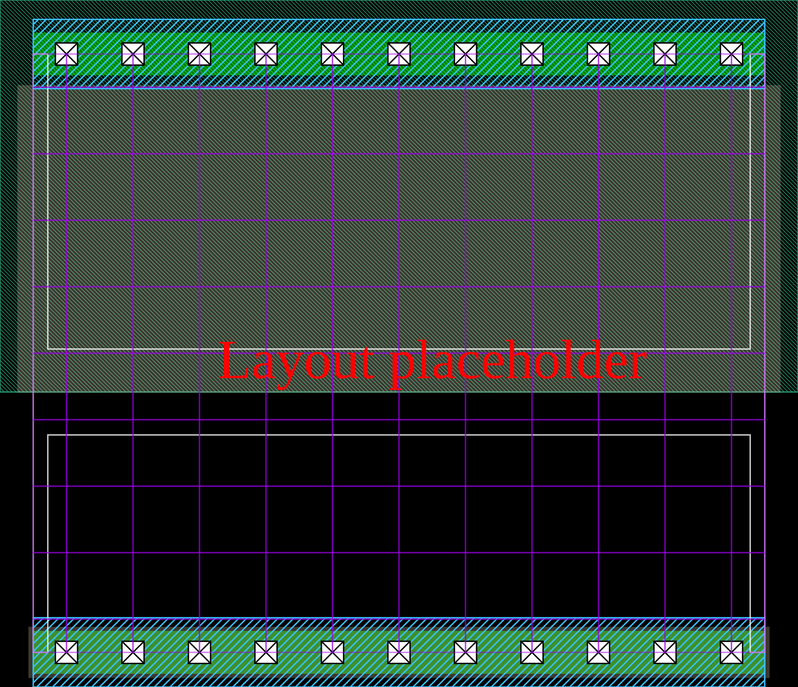

# AND2_Dx Group

# Pin information

| Pin   | Description   |
| :-:    | :-            |
| A     | Input A       |
| B     | Input B       |
| Y     | Output Y      |

# Logic function and Truth table

## Logic function (Python)

Y = And(A, B)

## Logic function (Boolean)
\\[Y = A \cdot B\\]

## Truth table

| A   | B   | Y   |
| :-: | :-: | :-: |
| 0   | 0   | 0   |
| 0   | 1   | 0   |
| 1   | 0   | 0   |
| 1   | 1   | 1   |

# Symbol

# Schematic

# Cell variants

| Cell name   | Width   [unit sites] | Area   [$\mu m^2$] |
| :-        | :-:   | :-:   |
| AND2_DL   | TBD   | TBD   |
| AND2_D1   | TBD   | TBD   |
| AND2_D2   | TBD   | TBD   |
| AND2_D4   | TBD   | TBD   |

## AND2_DL

Hierarchical SPICE netlist

CDL netlist

Layout

## AND2_D1

## AND2_D2

## AND2_D4

# Pin capacitance

# Static power

# Dynamic power

# Delay

