# Parametrized cells

Most digital gates can be constructed from few elementary gates that are commonly occurring.
Constructing complex gates from elementary gates is a good practice because it reduces complexity, or equivalently improves readability, and perhaps more importantly captures the design intent.

Preserving design intent is important for understanding the circuit operation, transistor sizing, help with optimizing the layout.
Furthermore, porting to a different process is easier when a higher level description is available, and the role and design intent of each transistor is clear.

Commonly used cells are made as parametrized Python cells, called `parcells`,  and are collected in the module `glow_parcells`.
All parametrized cells can be imported with the following code:

```python
from glow_parcells import *
```
Parametrized cells can be instantiated with desired parameter values and used to construct complex gates.

## `inv_par`

Cell `inv_par` is a parametrized inverter.

Schematic of the `inv_par` cell is given in the following figure.

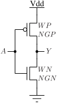

Symbol of the `inv_par` cell is given in the following figure.

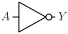

Pins of the `inv_par` cell are listed in the following table.
| Pin | Description |
| :-------: | :--------- |
| `A`       | Inverter input. |
| `Y`       | Inverter output. |
| `VDD`     | Power supply. Not shown in the symbol. |
| `VSS`     | Ground. Not shown in the symbol. |

Parameters of the `inv_par` cell are given in the following table.

| Parameter | Description |
| :-------: | :--------- |
| `WN`      | Total width of NMOS transistor. Default 300 nm. |
| `NGN`     | Number of gates of NMOS transistor. Default 1. |
| `WP`      | Total width of PMOS transistor. Default 450 nm. |
| `NGP`     | Number of gates of PMOS transistor. Default 1. |
| `L`       | Channel length. Default 130 nm. |

SPICE netlist of the `inv_par` cell is:
```
.subckt inv_par A Y VDD VSS WN=3e-07 WP=4.5e-07 L=1.3e-07 NGN=1 NGP=1
XMN0 Y A VSS VSS sg13_lv_nmos w={WN} l={L} ad={WN*3.1e-07} as={WN*3.1e-07} pd={2*(WN+3.1e-07)} ps={2*(WN+3.1e-07)} ng={NGN}
XMP0 Y A VDD VDD sg13_lv_pmos w={WP} l={L} ad={WP*3.1e-07} as={WP*3.1e-07} pd={2*(WP+3.1e-07)} ps={2*(WP+3.1e-07)} ng={NGP}
.ends
```

## `invz_par` and `invz2_par`

Cell `invz_par` is a parametrized inverter with tri-state output.

Schematic of the `invz_par` cell is given in the following figure.

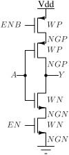

Symbol of the `invz_par` cell is given in the following figure.

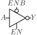

Pins of the `invz_par` cell are listed in the following table.
| Pin | Description |
| :-------: | :--------- |
| `A`       | Inverter input. |
| `Y`       | Inverter output. |
| `EN`      | Output enable, active high. |
| `ENB`     | Output enable, active low. |
| `VDD`     | Power supply. Not shown in the symbol. |
| `VSS`     | Ground. Not shown in the symbol. |

Parameters of the `invz_par` cell are given in the following table.

| Parameter | Description |
| :-------: | :--------- |
| `WN`      | Total width of NMOS transistor. Default 300 nm. |
| `NGN`     | Number of gates of NMOS transistor. Default 1. |
| `WP`      | Total width of PMOS transistor. Default 450 nm. |
| `NGP`     | Number of gates of PMOS transistor. Default 1. |
| `L`       | Channel length. Default 130 nm. |
| `WEAK`    | Flag to indicate that output is weak and its output can be changed by other circuits. Used in memory elements. |

SPICE netlist of the `invz_par` cell is:
```
.subckt invz_par A EN ENB Y VDD VSS WN=3e-07 WP=4.5e-07 L=1.3e-07 NGN=1 NGP=1 WEAK=0
XMN0 Y EN net0 VSS sg13_lv_nmos w={WN} l={L} ad={WN*3.1e-07} as={WN*3.1e-07} pd={2*(WN+3.1e-07)} ps={2*(WN+3.1e-07)} ng={NGN} 
XMN1 net0 A VSS VSS sg13_lv_nmos w={WN} l={L} ad={WN*3.1e-07} as={WN*3.1e-07} pd={2*(WN+3.1e-07)} ps={2*(WN+3.1e-07)} ng={NGN} 
XMP0 Y ENB net1 VDD sg13_lv_pmos w={WP} l={L} ad={WP*3.1e-07} as={WP*3.1e-07} pd={2*(WP+3.1e-07)} ps={2*(WP+3.1e-07)} ng={NGP} 
XMP1 net1 A VDD VDD sg13_lv_pmos w={WP} l={L} ad={WP*3.1e-07} as={WP*3.1e-07} pd={2*(WP+3.1e-07)} ps={2*(WP+3.1e-07)} ng={NGP} 
.ends
```

Cell `invz2_par` is equivalent to `invz_par` but with inputs assigned to different series transistors. It is provided to allow for layout optimization while preserving equivalent logic function.

SPICE netlist of the `invz2_par` cell is:
```
.subckt invz2_par A EN ENB Y VDD VSS WN=3e-07 WP=4.5e-07 L=1.3e-07 NGN=1 NGP=1 WEAK=0
XMN0 Y A net0 VSS sg13_lv_nmos w={WN} l={L} ad={WN*3.1e-07} as={WN*3.1e-07} pd={2*(WN+3.1e-07)} ps={2*(WN+3.1e-07)} ng={NGN} 
XMN1 net0 EN VSS VSS sg13_lv_nmos w={WN} l={L} ad={WN*3.1e-07} as={WN*3.1e-07} pd={2*(WN+3.1e-07)} ps={2*(WN+3.1e-07)} ng={NGN} 
XMP0 Y A net1 VDD sg13_lv_pmos w={WP} l={L} ad={WP*3.1e-07} as={WP*3.1e-07} pd={2*(WP+3.1e-07)} ps={2*(WP+3.1e-07)} ng={NGP} 
XMP1 net1 ENB VDD VDD sg13_lv_pmos w={WP} l={L} ad={WP*3.1e-07} as={WP*3.1e-07} pd={2*(WP+3.1e-07)} ps={2*(WP+3.1e-07)} ng={NGP} 
.ends
```

## `nand2_par`

Cell `nand2_par` is a parametrized two-input NAND cell.

Schematic of the `nand2_par` cell is given in the following figure.

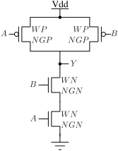

Symbol of the `nand2_par` cell is given in the following figure.

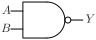

Pins of the `nand2_par` cell are listed in the following table.
| Pin | Description |
| :-------: | :--------- |
| `A`       | Input A of NAND2. |
| `B`       | Input B of NAND2. |
| `Y`       | NAND2 output. |
| `VDD`     | Power supply. Not shown in the symbol. |
| `VSS`     | Ground. Not shown in the symbol. |

Parameters of the `nand2_par` cell are given in the following table.

| Parameter | Description |
| :-------: | :--------- |
| `WN`      | Total width of NMOS transistor. Default 300 nm. |
| `NGN`     | Number of gates of NMOS transistor. Default 1. |
| `WP`      | Total width of PMOS transistor. Default 450 nm. |
| `NGP`     | Number of gates of PMOS transistor. Default 1. |
| `L`       | Channel length. Default 130 nm. |

SPICE netlist of the `nand2_par` cell is:
```
.subckt nand2_par A B Y VDD VSS WN=3e-07 WP=4.5e-07 L=1.3e-07 NGN=1 NGP=1
XMN0 n0 A VSS VSS sg13_lv_nmos w={WN} l={L} ad={WN*3.1e-07} as={WN*3.1e-07} pd={2*(WN+3.1e-07)} ps={2*(WN+3.1e-07)} ng={NGN} 
XMN1 Y B n0 VSS sg13_lv_nmos w={WN} l={L} ad={WN*3.1e-07} as={WN*3.1e-07} pd={2*(WN+3.1e-07)} ps={2*(WN+3.1e-07)} ng={NGN} 
XMP0 Y A VDD VDD sg13_lv_pmos w={WP} l={L} ad={WP*3.1e-07} as={WP*3.1e-07} pd={2*(WP+3.1e-07)} ps={2*(WP+3.1e-07)} ng={NGP} 
XMP1 Y B VDD VDD sg13_lv_pmos w={WP} l={L} ad={WP*3.1e-07} as={WP*3.1e-07} pd={2*(WP+3.1e-07)} ps={2*(WP+3.1e-07)} ng={NGP} 
.ends
```

In theory, parametrized two input NAND cell `nand2_par` can be used to construct a cell of any drive strength by increasing the total transistor width (`WP` and `WN`), and number of gates (`NGN` and `NGP`).
Layout of such cell would be suboptimal, as all sources/drains of series transistors would have to be connected together, and local routing would become increasingly complex for larger drive strengths.
Routing complexity is usually solved by relaxing the requirement that all drains connected together, as illustrated in the figure below.

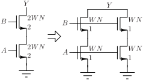

On the left side two series NMOS transistors have two gates and a total channel width of `2WN`, and all terminals are connected together. On the right side two gates are split and there are two series transistors connected in parallel.
Although not isomorphic, the two structures are logically equivalent.

Parallel-series transformation can be made for any transistor size and number of gates, and significantly reduces the layout complexity for transistors with large number of gates, i.e. large drive strengths.
It is convenient to have a parametrized series transistor pull-down network that can be used for the described parallel-series transformation, and its SPICE netlist `nand2_pdn_par` is given below.

```
.subckt nand2_pdn_par A B Y VDD VSS WN=3e-07 L=1.3e-07 NGN=1
XMN0 n0 B VSS VSS sg13_lv_nmos w={WN} l={L} ad={WN*3.1e-07} as={WN*3.1e-07} pd={2*(WN+3.1e-07)} ps={2*(WN+3.1e-07)} ng={NGN} 
XMN1 Y A n0 VSS sg13_lv_nmos w={WN} l={L} ad={WN*3.1e-07} as={WN*3.1e-07} pd={2*(WN+3.1e-07)} ps={2*(WN+3.1e-07)} ng={NGN} 
.ends
```
SPICE netlist with alternate assignment of inputs `A` and `B` is given below.
```
.subckt nand2_pdn2_par A B Y VDD VSS WN=3e-07 L=1.3e-07 NGN=1
XMN0 n0 A VSS VSS sg13_lv_nmos w={WN} l={L} ad={WN*3.1e-07} as={WN*3.1e-07} pd={2*(WN+3.1e-07)} ps={2*(WN+3.1e-07)} ng={NGN} 
XMN1 Y B n0 VSS sg13_lv_nmos w={WN} l={L} ad={WN*3.1e-07} as={WN*3.1e-07} pd={2*(WN+3.1e-07)} ps={2*(WN+3.1e-07)} ng={NGN} 
.ends
```
In some cases, a floating pull-down network is useful for layout optimization, and its SPICE netlist is given below.
```
.subckt nand2_pdn_float_par A B Y X VSS WN=3e-07 L=1.3e-07 NGN=1
XMN0 n0 B X VSS sg13_lv_nmos w={WN} l={L} ad={WN*3.1e-07} as={WN*3.1e-07} pd={2*(WN+3.1e-07)} ps={2*(WN+3.1e-07)} ng={NGN} 
XMN1 Y A n0 VSS sg13_lv_nmos w={WN} l={L} ad={WN*3.1e-07} as={WN*3.1e-07} pd={2*(WN+3.1e-07)} ps={2*(WN+3.1e-07)} ng={NGN} 
.ends
```
To complete the NAND gate, a complementary parametrized pull-up network is needed, and its SPICE netlist is given below. NAND pull-up network has transistors in parallel, so there is no need for alternate assignment netlist.
```
.subckt nand2_pun_par A B Y VDD VSS WP=4.5e-07 L=1.3e-07 NGP=1
XMP0 Y A VDD VDD sg13_lv_pmos w={WP} l={L} ad={WP*3.1e-07} as={WP*3.1e-07} pd={2*(WP+3.1e-07)} ps={2*(WP+3.1e-07)} ng={NGP} 
XMP1 Y B VDD VDD sg13_lv_pmos w={WP} l={L} ad={WP*3.1e-07} as={WP*3.1e-07} pd={2*(WP+3.1e-07)} ps={2*(WP+3.1e-07)} ng={NGP} 
.ends
```

## `nand3_par`

Cell `nand3_par` is a parametrized three-input NAND cell.

Schematic of the `nand3_par` cell is given in the following figure.

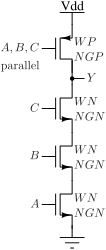

Symbol of the `nand3_par` cell is given in the following figure.

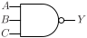

Pins of the `nand3_par` cell are listed in the following table.
| Pin | Description |
| :-------: | :--------- |
| `A`       | Input A of NAND3. |
| `B`       | Input B of NAND3. |
| `C`       | Input C of NAND3. |
| `Y`       | NAND3 output. |
| `VDD`     | Power supply. Not shown in the symbol. |
| `VSS`     | Ground. Not shown in the symbol. |

Parameters of the `nand3_par` cell are given in the following table.

| Parameter | Description |
| :-------: | :--------- |
| `WN`      | Total width of NMOS transistor. Default 1030 nm. |
| `NGN`     | Number of gates of NMOS transistor. Default 1. |
| `WP`      | Total width of PMOS transistor. Default 980 nm. |
| `NGP`     | Number of gates of PMOS transistor. Default 1. |
| `L`       | Channel length. Default 130 nm. |

SPICE netlist of the `nand3_par` cell is:

```
.subckt nand3_par A B C Y VDD VSS WN=1.03e-06 WP=9.8e-07 L=1.3e-07 NGN=1 NGP=1
XMN0 n0 C VSS VSS sg13_lv_nmos w={WN} l={L} ad={WN*3.1e-07} as={WN*3.1e-07} pd={2*(WN+3.1e-07)} ps={2*(WN+3.1e-07)} ng={NGN} 
XMN1 n1 B n0 VSS sg13_lv_nmos w={WN} l={L} ad={WN*3.1e-07} as={WN*3.1e-07} pd={2*(WN+3.1e-07)} ps={2*(WN+3.1e-07)} ng={NGN} 
XMN2 Y A n1 VSS sg13_lv_nmos w={WN} l={L} ad={WN*3.1e-07} as={WN*3.1e-07} pd={2*(WN+3.1e-07)} ps={2*(WN+3.1e-07)} ng={NGN} 
XMP0 Y A VDD VDD sg13_lv_pmos w={WP} l={L} ad={WP*3.1e-07} as={WP*3.1e-07} pd={2*(WP+3.1e-07)} ps={2*(WP+3.1e-07)} ng={NGP} 
XMP1 Y B VDD VDD sg13_lv_pmos w={WP} l={L} ad={WP*3.1e-07} as={WP*3.1e-07} pd={2*(WP+3.1e-07)} ps={2*(WP+3.1e-07)} ng={NGP} 
XMP2 Y C VDD VDD sg13_lv_pmos w={WP} l={L} ad={WP*3.1e-07} as={WP*3.1e-07} pd={2*(WP+3.1e-07)} ps={2*(WP+3.1e-07)} ng={NGP} 
.ends
```

NAND3 cell with large drive strength layout can be optimized by transforming the pull-down network in the similar manner as NAND2.

## `nand4_par`

Cell `nand4_par` is a parametrized four-input NAND cell.

Schematic of the `nand4_par` cell is given in the following figure.

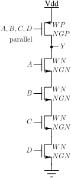

Symbol of the `nand4_par` cell is given in the following figure.

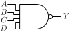

Pins of the `nand4_par` cell are listed in the following table.
| Pin | Description |
| :-------: | :--------- |
| `A`       | Input A of NAND4. |
| `B`       | Input B of NAND4. |
| `C`       | Input C of NAND4. |
| `D`       | Input D of NAND4. |
| `Y`       | NAND4 output. |
| `VDD`     | Power supply. Not shown in the symbol. |
| `VSS`     | Ground. Not shown in the symbol. |

Parameters of the `nand4_par` cell are given in the following table.

| Parameter | Description |
| :-------: | :--------- |
| `WN`      | Total width of NMOS transistor. Default 800 nm. |
| `NGN`     | Number of gates of NMOS transistor. Default 1. |
| `WP`      | Total width of PMOS transistor. Default 700 nm. |
| `NGP`     | Number of gates of PMOS transistor. Default 1. |
| `L`       | Channel length. Default 130 nm. |

SPICE netlist of the `nand4_par` cell is:

```
.subckt nand4_par A B C D Y VDD VSS WN=8e-07 WP=7e-07 L=1.3e-07 NGN=1 NGP=1
XMN0 n0 D VSS VSS sg13_lv_nmos w={WN} l={L} ad={WN*3.1e-07} as={WN*3.1e-07} pd={2*(WN+3.1e-07)} ps={2*(WN+3.1e-07)} ng={NGN} 
XMN1 n1 C n0 VSS sg13_lv_nmos w={WN} l={L} ad={WN*3.1e-07} as={WN*3.1e-07} pd={2*(WN+3.1e-07)} ps={2*(WN+3.1e-07)} ng={NGN} 
XMN2 n2 B n1 VSS sg13_lv_nmos w={WN} l={L} ad={WN*3.1e-07} as={WN*3.1e-07} pd={2*(WN+3.1e-07)} ps={2*(WN+3.1e-07)} ng={NGN} 
XMN3 Y A n2 VSS sg13_lv_nmos w={WN} l={L} ad={WN*3.1e-07} as={WN*3.1e-07} pd={2*(WN+3.1e-07)} ps={2*(WN+3.1e-07)} ng={NGN} 
XMP0 Y A VDD VDD sg13_lv_pmos w={WP} l={L} ad={WP*3.1e-07} as={WP*3.1e-07} pd={2*(WP+3.1e-07)} ps={2*(WP+3.1e-07)} ng={NGP} 
XMP1 Y B VDD VDD sg13_lv_pmos w={WP} l={L} ad={WP*3.1e-07} as={WP*3.1e-07} pd={2*(WP+3.1e-07)} ps={2*(WP+3.1e-07)} ng={NGP} 
XMP2 Y C VDD VDD sg13_lv_pmos w={WP} l={L} ad={WP*3.1e-07} as={WP*3.1e-07} pd={2*(WP+3.1e-07)} ps={2*(WP+3.1e-07)} ng={NGP} 
XMP3 Y D VDD VDD sg13_lv_pmos w={WP} l={L} ad={WP*3.1e-07} as={WP*3.1e-07} pd={2*(WP+3.1e-07)} ps={2*(WP+3.1e-07)} ng={NGP} 
.ends
```
NAND4 cell with large drive strength layout can be optimized by transforming the pull-down network in the similar manner as NAND2.

## `nor2_par`

Cell `nor2_par` is a parametrized two-input NAND cell.

Schematic of the `nor2_par` cell is given in the following figure.

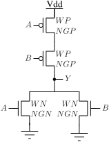

Symbol of the `nor2_par` cell is given in the following figure.

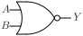

Pins of the `nor2_par` cell are listed in the following table.
| Pin | Description |
| :-------: | :--------- |
| `A`       | Input A of NOR2. |
| `B`       | Input B of NOR2. |
| `Y`       | NOR2 output. |
| `VDD`     | Power supply. Not shown in the symbol. |
| `VSS`     | Ground. Not shown in the symbol. |

Parameters of the `nor2_par` cell are given in the following table.

| Parameter | Description |
| :-------: | :--------- |
| `WN`      | Total width of NMOS transistor. Default 640 nm. |
| `NGN`     | Number of gates of NMOS transistor. Default 1. |
| `WP`      | Total width of PMOS transistor. Default 980 nm. |
| `NGP`     | Number of gates of PMOS transistor. Default 1. |
| `L`       | Channel length. Default 130 nm. |

SPICE netlist of the `nor2_par` cell is:
```
.subckt nor2_par A B Y VDD VSS WN=6.4e-07 WP=9.8e-07 L=1.3e-07 NGN=1 NGP=1
XMN0 Y A VSS VSS sg13_lv_nmos w={WN} l={L} ad={WN*3.1e-07} as={WN*3.1e-07} pd={2*(WN+3.1e-07)} ps={2*(WN+3.1e-07)} ng={NGN} 
XMN1 Y B VSS VSS sg13_lv_nmos w={WN} l={L} ad={WN*3.1e-07} as={WN*3.1e-07} pd={2*(WN+3.1e-07)} ps={2*(WN+3.1e-07)} ng={NGN} 
XMP0 n0 A VDD VDD sg13_lv_pmos w={WP} l={L} ad={WP*3.1e-07} as={WP*3.1e-07} pd={2*(WP+3.1e-07)} ps={2*(WP+3.1e-07)} ng={NGP} 
XMP1 Y B n0 VDD sg13_lv_pmos w={WP} l={L} ad={WP*3.1e-07} as={WP*3.1e-07} pd={2*(WP+3.1e-07)} ps={2*(WP+3.1e-07)} ng={NGP} 
.ends
```

As with `nand2_par`, layout optimization for cells with larger drive strengths can be performed by manipulating pull-up and pull-down networks.
SPICE netlist of parametrized `NOR2` pull-down network is given below.
```
.subckt nor2_pdn_par A B Y VDD VSS WN=3e-07 L=1.3e-07 NGN=1
XMN0 Y B VSS VSS sg13_lv_nmos w={WN} l={L} ad={WN*3.1e-07} as={WN*3.1e-07} pd={2*(WN+3.1e-07)} ps={2*(WN+3.1e-07)} ng={NGN} 
XMN1 Y A VSS VSS sg13_lv_nmos w={WN} l={L} ad={WN*3.1e-07} as={WN*3.1e-07} pd={2*(WN+3.1e-07)} ps={2*(WN+3.1e-07)} ng={NGN} 
.ends
```
Complementary pull-up networks are available in three variants - two variants of pin assignment and a floating version - and they are given in SPICE netlists below.
```
.subckt nor2_pun_par A B Y VDD VSS WP=3e-07 L=1.3e-07 NGP=1
XMP0 n0 A VDD VDD sg13_lv_pmos w={WP} l={L} ad={WP*3.1e-07} as={WP*3.1e-07} pd={2*(WP+3.1e-07)} ps={2*(WP+3.1e-07)} ng={NGP} 
XMP1 Y B n0 VDD sg13_lv_pmos w={WP} l={L} ad={WP*3.1e-07} as={WP*3.1e-07} pd={2*(WP+3.1e-07)} ps={2*(WP+3.1e-07)} ng={NGP} 
.ends
```
```
.subckt nor2_pun2_par A B Y VDD VSS WP=3e-07 L=1.3e-07 NGP=1
XMP0 n0 B VDD VDD sg13_lv_pmos w={WP} l={L} ad={WP*3.1e-07} as={WP*3.1e-07} pd={2*(WP+3.1e-07)} ps={2*(WP+3.1e-07)} ng={NGP} 
XMP1 Y A n0 VDD sg13_lv_pmos w={WP} l={L} ad={WP*3.1e-07} as={WP*3.1e-07} pd={2*(WP+3.1e-07)} ps={2*(WP+3.1e-07)} ng={NGP} 
.ends
```
```
.subckt nor2_pun_float_par A B Y X VDD WP=3e-07 L=1.3e-07 NGP=1
XMP0 n0 A X VDD sg13_lv_pmos w={WP} l={L} ad={WP*3.1e-07} as={WP*3.1e-07} pd={2*(WP+3.1e-07)} ps={2*(WP+3.1e-07)} ng={NGP} 
XMP1 Y B n0 VDD sg13_lv_pmos w={WP} l={L} ad={WP*3.1e-07} as={WP*3.1e-07} pd={2*(WP+3.1e-07)} ps={2*(WP+3.1e-07)} ng={NGP} 
.ends
```
These parametrized circuits are sufficient to construct `NOR2` of any drive strength.

## `nor3_par`

Cell `nor3_par` is a parametrized three-input NOR cell.

Schematic of the `nor3_par` cell is given in the following figure.

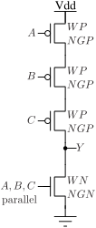

Symbol of the `nor3_par` cell is given in the following figure.

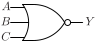

Pins of the `nor3_par` cell are listed in the following table.
| Pin | Description |
| :-------: | :--------- |
| `A`       | Input A of NOR3. |
| `B`       | Input B of NOR3. |
| `C`       | Input C of NOR3. |
| `Y`       | NOR3 output. |
| `VDD`     | Power supply. Not shown in the symbol. |
| `VSS`     | Ground. Not shown in the symbol. |

Parameters of the `nor3_par` cell are given in the following table.

| Parameter | Description |
| :-------: | :--------- |
| `WN`      | Total width of NMOS transistor. Default 500 nm. |
| `NGN`     | Number of gates of NMOS transistor. Default 1. |
| `WP`      | Total width of PMOS transistor. Default 1250 nm. |
| `NGP`     | Number of gates of PMOS transistor. Default 1. |
| `L`       | Channel length. Default 130 nm. |

SPICE netlist of the `nor3_par` cell is:

```
.subckt nor3_par A B C Y VDD VSS WN=5e-07 WP=1.25e-06 L=1.3e-07 NGN=1 NGP=1
XMN0 Y A VSS VSS sg13_lv_nmos w={WN} l={L} ad={WN*3.1e-07} as={WN*3.1e-07} pd={2*(WN+3.1e-07)} ps={2*(WN+3.1e-07)} ng={NGN} 
XMN1 Y B VSS VSS sg13_lv_nmos w={WN} l={L} ad={WN*3.1e-07} as={WN*3.1e-07} pd={2*(WN+3.1e-07)} ps={2*(WN+3.1e-07)} ng={NGN} 
XMN2 Y C VSS VSS sg13_lv_nmos w={WN} l={L} ad={WN*3.1e-07} as={WN*3.1e-07} pd={2*(WN+3.1e-07)} ps={2*(WN+3.1e-07)} ng={NGN} 
XMP0 n0 A VDD VDD sg13_lv_pmos w={WP} l={L} ad={WP*3.1e-07} as={WP*3.1e-07} pd={2*(WP+3.1e-07)} ps={2*(WP+3.1e-07)} ng={NGP} 
XMP1 n1 B n0 VDD sg13_lv_pmos w={WP} l={L} ad={WP*3.1e-07} as={WP*3.1e-07} pd={2*(WP+3.1e-07)} ps={2*(WP+3.1e-07)} ng={NGP} 
XMP2 Y C n1 VDD sg13_lv_pmos w={WP} l={L} ad={WP*3.1e-07} as={WP*3.1e-07} pd={2*(WP+3.1e-07)} ps={2*(WP+3.1e-07)} ng={NGP} 
.ends
```

NOR3 cell with large drive strength layout can be optimized by transforming the pull-down network in the similar manner as NOR2.

## `nor4_par`

Cell `nor4_par` is a parametrized four-input NOR cell.

Schematic of the `nor4_par` cell is given in the following figure.

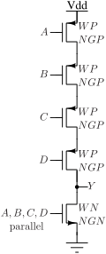

Symbol of the `nor4_par` cell is given in the following figure.

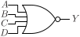

Pins of the `nor4_par` cell are listed in the following table.
| Pin | Description |
| :-------: | :--------- |
| `A`       | Input A of NOR4. |
| `B`       | Input B of NOR4. |
| `C`       | Input C of NOR4. |
| `D`       | Input D of NOR4. |
| `Y`       | NOR4 output. |
| `VDD`     | Power supply. Not shown in the symbol. |
| `VSS`     | Ground. Not shown in the symbol. |

Parameters of the `nor4_par` cell are given in the following table.

| Parameter | Description |
| :-------: | :--------- |
| `WN`      | Total width of NMOS transistor. Default 500 nm. |
| `NGN`     | Number of gates of NMOS transistor. Default 1. |
| `WP`      | Total width of PMOS transistor. Default 1400 nm. |
| `NGP`     | Number of gates of PMOS transistor. Default 1. |
| `L`       | Channel length. Default 130 nm. |

SPICE netlist of the `nor4_par` cell is:

```
.subckt nor4_par A B C D Y VDD VSS WN=5e-07 WP=1.4e-06 L=1.3e-07 NGN=1 NGP=1
XMN0 Y A VSS VSS sg13_lv_nmos w={WN} l={L} ad={WN*3.1e-07} as={WN*3.1e-07} pd={2*(WN+3.1e-07)} ps={2*(WN+3.1e-07)} ng={NGN} 
XMN1 Y B VSS VSS sg13_lv_nmos w={WN} l={L} ad={WN*3.1e-07} as={WN*3.1e-07} pd={2*(WN+3.1e-07)} ps={2*(WN+3.1e-07)} ng={NGN} 
XMN2 Y C VSS VSS sg13_lv_nmos w={WN} l={L} ad={WN*3.1e-07} as={WN*3.1e-07} pd={2*(WN+3.1e-07)} ps={2*(WN+3.1e-07)} ng={NGN} 
XMN3 Y D VSS VSS sg13_lv_nmos w={WN} l={L} ad={WN*3.1e-07} as={WN*3.1e-07} pd={2*(WN+3.1e-07)} ps={2*(WN+3.1e-07)} ng={NGN} 
XMP0 n0 D VDD VDD sg13_lv_pmos w={WP} l={L} ad={WP*3.1e-07} as={WP*3.1e-07} pd={2*(WP+3.1e-07)} ps={2*(WP+3.1e-07)} ng={NGP} 
XMP1 n1 C n0 VDD sg13_lv_pmos w={WP} l={L} ad={WP*3.1e-07} as={WP*3.1e-07} pd={2*(WP+3.1e-07)} ps={2*(WP+3.1e-07)} ng={NGP} 
XMP2 n2 B n1 VDD sg13_lv_pmos w={WP} l={L} ad={WP*3.1e-07} as={WP*3.1e-07} pd={2*(WP+3.1e-07)} ps={2*(WP+3.1e-07)} ng={NGP} 
XMP3 Y A n2 VDD sg13_lv_pmos w={WP} l={L} ad={WP*3.1e-07} as={WP*3.1e-07} pd={2*(WP+3.1e-07)} ps={2*(WP+3.1e-07)} ng={NGP} 
.ends
```

NOR4 cell with large drive strength layout can be optimized by transforming the pull-down network in the similar manner as NOR2.
