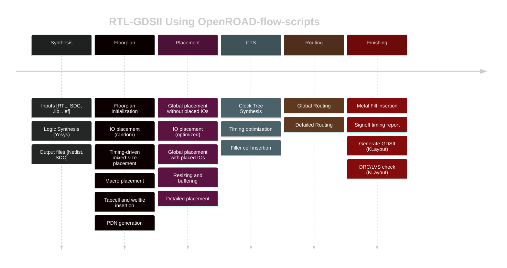

# A short overview of ASIC digital design flow

The objective of this section is to give a short overview of ASIC digital design flow and the role, uses and different libraries and formats that make a digital standard cell library.

The design of a digital chip is traditionally partitioned into two major phases: **front-end** and **back-end** design.

"**Front-end** design" refers to the design of a digital chip on a logical level in a Hardware Description Language (HDL), such as VHDL, SystemVerilog, Chisel, SpinalHDL, ..., or in a High Level Synthesis (HLS) language, or any combination of them. 
Design in HDLs is usually called Register-Transfer Level (RTL), because data is explicitly moved between registers, while the HLS design is algorithmic oriented, without explicit register assignments or register instantiation. Eventually the HLS design is compiled and translated (lowered) to (usually) SystemVerilog that is used in the backend phase.
We will assume that the RTL design is done and focus only to back-end design.

"**Back-end** design" refers to the physical implementation of the designed logic in a chosen integrated circuit process. Physical implementation takes many steps, and in the end results in geometric representation of transistors, vias, metal traces etc. that is used to produce mask layouts for chip fabrication.
Geometric representation of chip layout is usually stored in an industry standard library format such as GDSII, OASIS or OpenAcess.

[GDSII](https://en.wikipedia.org/wiki/GDSII) is the oldest - created in 1970s - and the simplest format, that is still used. It stores per-layer geometry as paths, rectangles, polygons, labels and other shapes grouped in cells, that can be referenced in other cells to form complex layouts.

[OASIS](https://en.wikipedia.org/wiki/Open_Artwork_System_Interchange_Standard) (Open Artwork System Interchange Standard) is a standard from 2002 that was designed to be a replacement for GDSII. It is an industry standard, but it is not open.

[OpenAccess](https://en.wikipedia.org/wiki/OpenAccess) is (contrary to its name) a proprietary set of standards used in proprietary tools to allow interoperability. Although original motivation was to ensure interoperability, many vendors have added extensions that break it, and is usually not used in open source tools.

Geometry stored in a layout library is used to produce a set of mask layouts, usually by performing Boolean operations on shapes in different layers.
Each mask layout is used to produce a reticle used in one or more steps during the fabrication of chip features, and defines a certain feature - such as opening for source or drain diffusion implants, polysilicon gates, contacts, vias, metal traces etc., and ultimately define the functionality of the chip on the lowest level.

Back-end design can be done by manually drawing transistors, either as parametrized cells or rectangles of polysilicon over rectangles of diffusion, contacts and interconnects in metal layers. This kind of design is called "full custom design" and is rarely done in practice because it is very time consuming and infeasible for complex designs.
Full custom design is usually only used for timing/power critical parts, such as design of [bit slice in Arithmetic-Logic Unit](https://www.southampton.ac.uk/~bim/notes/vlsi/lecture/pdf/vlsi04.pdf).

Back-end implementation can be simplified and automated by using a library of pre-defined logic cells. Pre-defined cells should contain transistors and local interconnect that implement a certain logic function. 
All information about semiconductors (transistors) is contained in a standard cell, so only the choice of cells, their placement and metal routing is done in the back-end phase.
Such a library of pre-defined cells is called a standard digital cell library, and is technology dependent.

It may seem that there is a clear-cut divide between front-end RTL design to solve a logical problem, and a back-end design to implement it, but it is not the case.
Delay of standard cells affects the optimal pipelining strategy for a given operating frequency - the same design may need fewer pipeline stages to work at the same operating frequency in a more advanced process node, and that should be accounted in the RTL design.
Tools for digital design flow *may* reduce the impact of suboptimal choice of pipelining strategy by [register retiming](https://en.wikipedia.org/wiki/Retiming) but it will nevertheless be a suboptimal design.

Even in the same process node, different metal stack options can result in routing congestions that may determine the optimum bus width for a specified operating power, performance and area (PPA).
Again, digital design tools *may* soften be performance degradation, but the design will not be optimal.

One of the most advanced open source flows for back-end RTL to GDSII digital design is [OpenROAD](https://github.com/The-OpenROAD-Project/OpenROAD). OpenROAD is a collection of tools and scripts for back-end digital implementation, that is shown in the figure below (taken from [OpenROAD README](https://github.com/The-OpenROAD-Project/OpenROAD)).

The first step in a digital implementation flow is (logic) Synthesis.
Synthesis is a process that takes RTL description of a digital design, SDC (Synopsys Design Constraints) file for design constraints and Liberty library of standard cells.
SDC file is written by a designer to define design constraints such as input/output delays, clocks, timing exceptions etc.
Liberty library contains information about gates available in a standard cell library: input and output pins, logic function, tables for delay and power calculation.

Synthesis tool, in this case Yosys, reads in the RTL design, parses it and transforms it into a set of Boolean expressions and memory elements (flip-flops or latches) for implementation of combinatorial and sequential circuits.

The main task of a synthesis tool is to map the design's Boolean equations to available logic cells present in the Liberty library.
In theory, any Boolean expression can be mapped to a complete set of Boolean functions. A complete set of Boolean functions can be a single function, e.g. NAND forms a complete set, and so does NOR.
However, synthesizing a digital circuit by using only NAND or NOR gates, although theoretically correct, is beyond suboptimal. 
For example, it takes 4 NAND gates to implement a NOR gate, and vice-versa.

A specialized, carefully designed and optimized set of cells that implement various digital functions with several inputs, and possibly with variants of some inputs/outputs inverted, enables the synthesis tool to optimally map the design equations to available cells.
Having in mind that logic mapping is a NP-hard problem, and that synthesis tools use heuristics, and possibly non-deterministic algorithms, to solve a problem in a reasonable time, optimality should be understood conditionally.

The output of a synthesis tool is a structural, i.e. gate level, Verilog netlist that implements the user's design. Structural Verilog netlist instantiates library cells and connects their inputs/outputs - it does not contain any behavioral code. Therefore, it can be implemented in silicon by placing the instantiated cells and connecting them with metal tracks.

Floorplanning tool reads a structural Verilog netlist and a LEF (Library Exchange File) library that contains abstract views of standard cells and places them in a grid. Abstract view is a simplified layout of the cell, containing only the data pertinent to digital implementation - cell shape, pin positions and shape, routing obstructions and gate or diffusion area that is used in antenna violation checks. Floorplanning tool also places special cells if they are needed, such as substrate and n-well ties for biasing, or dedicated end cap cells on edges of the placement grid.

Placement tool then places the cells so that connected cells are close to optimize routing. Besides placing the cells present in the structural Verilog netlist, placement tool may insert buffers to reduce the fan out of heavily loaded outputs, and it may resize the existing cells.
Standard cells are made in several "sizes", where the cell "size" refers to the drive strength of a cell.
Drive strength of a cell is usually denoted as a suffix _Dx, where `x` is the drive strength `x=1,2,...`.
Cells with higher drive strength have wider transistors and can drive higher capacitive loads for the same propagation time, but they occupy more area, and have a higher static and dynamic power.
To minimize power consumption and occupied silicon area, a cell with minimum drive strength should be used, provided that it can drive a given output load according to timing constraints. 
Therefore, it is desirable to have a cell in many drive strengths so that a tool can perform cell resizing effectively.

Clock signal is used to synchronize data transfers between sequential elements, such as flip-flops, and is a very high fanout net.
Distributing the clock signal to every flip-flop with low timing skew is not trivial, and is in a Clock Tree Synthesis (CTS) step.
In a CTS step a clock tree, consisting of dedicated clock buffer cells, is designed to minimize the timing skew between different clock leaf outputs.

In the routing phase the inputs and outputs of cells are connected with metal tracks and vias. 
Minimum spacing between metal tracks and the height of standard cells determine the number of horizontal tracks available per row of standard cells, while the number of vertical tracks is determined by the width of the digital design.
Horizontal and vertical tracks are usually assigned to alternate metal layers, e.g. horizontal tracks in even metal number (M2, M4, etc.) and vertical tracks in odd metal number (M3, M5, etc.), while lowest metal level (M1) is usually used for local routing in standard cells.
Assignment of metals to horizontal and vertical tracks is not strict - a short vertical segment can be made in metal assigned to horizontal tracks to minimize the number of vias.

Routing congestion occurs if there are not enough routing resources, i.e. horizontal and vertical tracks, to route all nets and the design cannot be routed at all, or is routed with a severe timing penalty.
It can be resolved by increasing the digital core area, or equivalently reducing the core utilization ratio, and re-run the place and route.
Core utilization ratio is the ratio of the area of gates to the core area.
Typical core utilization is in the range of 80%, but can be less for designs with many high fanout nets, or higher for designs with low fanout.

Finalization step inserts metal fills - patches of dummy metal patterns - that bring the local and global metal density into range required by the foundry DRC rules. Following the minimum and maximum density rules, both of metals and diffusion and polysilicon, is important to achieve the required planarity during manufacturing.
Dummy fill is followed by parasitic RC extraction and final static timing checks.
Finally, GDSII layout is generated by replacing the abstract LEF views with cell layouts.

Digital implementation flow essentially only places standard cells and routes metal tracks - no semiconductor design is involved at all, as the semiconductor part is contained in the design of standard cells.

To summarize, the effectiveness of the digital design flow is strongly dependent on the quality of a standard cell library used.
Standard cell library with a large number of cells implementing various Boolean functions in many drive strengths is likely to produce better PPA than a library with fewer cells.
