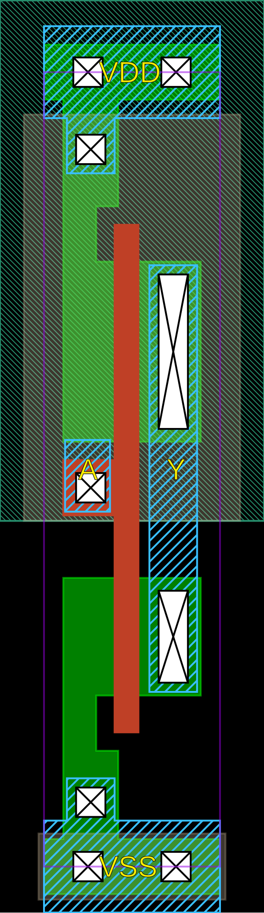
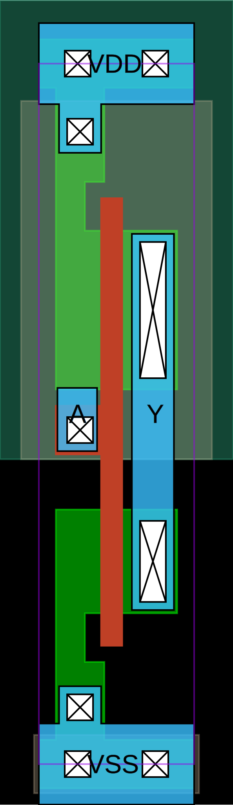
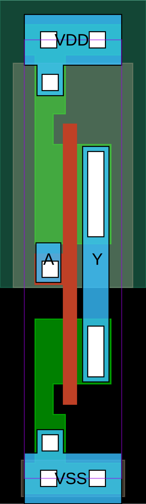

# GLOW Utilities

Python package `glow_utils` provides utility functions used for design of digital standard cell library.
Package can be installed with
``` sh
pip install .
```
For development it is convenient to link the Python files to the package installation as
``` sh
pip install -e .
```
so that changes in Python files are immediately available without the need to reinstall the package.

## Quick start

GLOW utilities are designed to aid the development of circuits, specifically digital standard cells. They provide a programmatic way for development of parametrized hierarchical circuits, performing various checks, transformations and exporting to SPICE or CDL netlists.

Minium example of parametrized CMOS inverter is
``` Python
from glow_utils.symsubcircuit import Symsubcircuit
from glow_utils.symmosfet import SymNMOS, SymPMOS

inv_par = Symsubcircuit("inv_par", ['A', 'Y', 'VDD', 'VSS'], {'WN' : 300e-9, 'WP' : 450e-9, 'L' : 130e-9, 'NGN' : 1, 'NGP' : 1})
n = SymNMOS("N0", ['Y', 'A', 'VSS', 'VSS'], {'w' : 'ppar("WN")', 'l' : 'ppar("L")', 'ng' : 'ppar("NGN")'})
p = SymPMOS("P0", ['Y', 'A', 'VDD', 'VDD'], {'w' : 'ppar("WP")', 'l' : 'ppar("L")', 'ng' : 'ppar("NGP")'})
inv_par.addElement([n, p])
print(inv_par.netlist_SPICE())
```
The output of this Python code is
```spice
.subckt inv_par A Y VDD VSS WN=3e-07 WP=4.5e-07 L=1.3e-07 NGN=1 NGP=1
MN0 Y A VSS VSS sg13_lv_nmos w={WN} l={L} ad={WN*3.1e-07} as={WN*3.1e-07} pd={2*(WN+3.1e-07)} ps={2*(WN+3.1e-07)} ng={NGN}
MP0 Y A VDD VDD sg13_lv_pmos w={WP} l={L} ad={WP*3.1e-07} as={WP*3.1e-07} pd={2*(WP+3.1e-07)} ps={2*(WP+3.1e-07)} ng={NGP}
.ends
```
A simple CMOS inverter testbench can be made by creating an instance of the inverter and defining transistor models - in this case a dummy `LEVEL 1` MOSFET model.
```spice
X1 in out vdd 0 inv_par
.model sg13_lv_nmos NMOS (LEVEL=1 VTO=0.3 KP=50u)
.model sg13_lv_pmos PMOS (LEVEL=1 VTO=-0.3 KP=20u)
```
What is left is to define voltage sources and simulations
```spice
Vdd vdd 0 1.2
Vin in 0 PULSE(0 1.2 0 1n 1n 10n 20n)
Cl out 0 10f
.tran 0.1n 100n
.control
run
plot v(in) v(out)
.endc
.end
```
Saving the file as `tb_inv.cir` and running a simulation with
```sh
ngspice tb_inv.cir
```
results in an error
```sh
  unknown parameter (ng) 
    Simulation interrupted due to error!
```
This error is a consequence of a chosen inadequate MOSFET model that does not support parameter `ng`, that is supported by target technology. Netlist can be corrected by deleting the extra parameter, and the whole corrected netlist is given in the listing below:
```spice
* CMOS Inverter Testbench
.subckt inv_par A Y VDD VSS WN=3e-07 WP=4.5e-07 L=1.3e-07
MN0 Y A VSS VSS sg13_lv_nmos w={WN} l={L} ad={WN*3.1e-07} as={WN*3.1e-07} pd={2*(WN+3.1e-07)} ps={2*(WN+3.1e-07)}
MP0 Y A VDD VDD sg13_lv_pmos w={WP} l={L} ad={WP*3.1e-07} as={WP*3.1e-07} pd={2*(WP+3.1e-07)} ps={2*(WP+3.1e-07)}
.ends

X1 in out vdd 0 inv_par
.model sg13_lv_nmos NMOS (LEVEL=1 VTO=0.3 KP=50u)
.model sg13_lv_pmos PMOS (LEVEL=1 VTO=-0.3 KP=20u)
Vdd vdd 0 1.2
Vin in 0 PULSE(0 1.2 0 1n 1n 10n 20n)
Cl out 0 10f
.tran 0.1n 100n
.control
run
plot v(in) v(out)
.endc
.end
```
This time the simulation runs successfully and the input and output waveforms are displayed.

This simple example shows how to use GLOW utils to design a CMOS inverter, but they can be used for much complex cases.

## Symtech class

Symtech class is intended to be a container of all relevant technology information, so that the rest of the `glow_utils` classes can be used with any technology.
Technology information is stored in a dictionary, that can be read from JSON file.
For example, JSON file for IHP SG13G2 technology is:
```json
{
    "processName" : "sg13g2",
    "nmosModelName" : "sg13_lv_nmos",
    "pmosModelName" : "sg13_lv_pmos",
    "nmosAS" : "ipar('w') * 310e-9",
    "nmosAD" : "ipar('w') * 310e-9",
    "nmosPS" : "2 * (ipar('w') + 310e-9)",
    "nmosPD" : "2 * (ipar('w') + 310e-9)",
    "pmosAS" : "ipar('w') * 310e-9",
    "pmosAD" : "ipar('w') * 310e-9",
    "pmosPS" : "2 * (ipar('w') + 310e-9)",
    "pmosPD" : "2 * (ipar('w') + 310e-9)"
}
```
Predefined key names are given in the following table.
|Key           | Description          |
|--------------|----------------------|
|processName   | Name of technology.  |
|nmosModelName | Name of NMOS transistor model.  |
|pmosModelName | Name of PMOS transistor model.  |
|nmosAS        | Expression to calculate NMOS source diffusion area. |
|nmosAD        | Expression to calculate NMOS drain diffusion area. |
|pmosAS        | Expression to calculate PMOS source diffusion area. |
|pmosAD        | Expression to calculate PMOS drain diffusion area. |
|nmosPS        | Expression to calculate NMOS source diffusion perimeter. |
|nmosPD        | Expression to calculate NMOS drain diffusion perimeter. |
|pmosPS        | Expression to calculate PMOS source diffusion perimeter. |
|pmosPD        | Expression to calculate PMOS drain diffusion perimeter. |

Function `ipar` used in expressions is defined in the [Symdevice](#symdevice-class) class.

New keys can be added to JSON file and used to expand or add new functionalities.
Unused keys in JSON file will be ignored.

## Symdict class

Symdict is a sub-class of Python `dict` to allow hierarchical parameter evaluation. 
It is mainly used internally in other classes to build hierarchy of circuit parameters.
Dictionary keys and values are evaluated in a hierarchical manner,
where keys and values defined in local dictionary take precedence over upper levels.

For example:
```python
from glow_utils.symdict import Symdict
topDict = { 'x':1, 'y':2 }
level1Dict = Symdict( topDict, localDict={'x':5 } )
print(level1Dict['x'])
# 5
```
`level1Dict['x']` evaluates to 5 instead of 1, since the local parameter value of `x` takes precedence over the global value.
The same principle applies for any depth of dictionary hierarchy.
If the key in not defined in any dictionary, a KeyError exception is raised, as in a regular Python `dict`.

## Symparam class

Symparam class is used to evaluate symbolic parameter expressions.
Symbolic expressions can be expanded by substitution so that resulting expression contains only symbols that evaluate to numbers or are not defined. Alternatively, symbolic expressions can be evaluated to get a numeric value.
When `Symparam` is used with `Symdict`, it provides means for hierarchical evaluation of expressions, either to symbolic expression or numerical value, and is mainly used internally by other classes.

`Symparam` constructor takes two arguments, a dictionary of parameters `paramDict` and a dictionary of functions `fnDict`:
```python
evaluator = Symparam(paramDict, fnDict)
```
Instance `evaluator` of `Symparam` uses provided `paramDict` and `fnDict` to substitute or evaluate symbolic expressions.
Method `substitute` performs symbolic substitution on a given expression and results in a symbolic expression.
```python
def substitute(self, paramExpr, instanceFns = {}, allowSymbols = False):
```
Argument `paramExpr` is a string containing an expression to work on.
Optional argument `instanceFns` allows for additional, e.g. per-instance defined, functions that are not defined in `fnDict`.
Optional argument `allowSymbols` controls the behavior of symbolic substitution. If `allowSymbols = False` an exception is raised if a symbol is not defined - it does not expand to other symbols nor does it have a numerical value. If `allowSymbols = True` the substitution stops when a symbol is not defined, without raising an exception.

For example, substitution on expression `x + y` can be performed as:
```python
evaluator.substitute('x + y') # Result is a symbolic expression
```

Method `evaluate` performs symbolic substitution and evaluates a given expression to a number.
```python
def evaluate(self, paramExpr, instanceFns = {}):
```
Argument `paramExpr` is a string containing an expression to work on.
Optional argument `instanceFns` allows for additional, e.g. per-instance defined, functions that are not defined in `fnDict`.
Method `evaluate` tries to evaluate an expression to a number, and raises an exception if it can't be done - e.g. a symbol does not evaluate to number for available parameter and function dictionaries.

For example, evaluation of expression `x + y` can be performed as:
```python
evaluator.evaluate('x + y') # Result is a number
```

A complete example of `Symparam` basic use is given in the code below:
```python
from glow_utils.symparam import Symparam

values = {  'x' : 'a+b',
            'y' : 'c',
            'a' : 1,
            'b' : 2,
            'c' : 3}

params = Symparam(values, {})
expression = 'x * y'
print('Dictionary')
print(values)
print('Expression')
print(expression)
print('Expression after substitution')
print(params.substitute( expression ))
print('Expression numeric value')
print(params.evaluate( expression ))
```
The output of the previous Python code is
```
Dictionary
{'x': 'a+b', 'y': 'c', 'a': 1, 'b': 2, 'c': 3}
Expression
x * y
Expression after substitution
(a+b)*c
Expression numeric value
9
```

## Symdevice class

`Symdevice` is base class for devices, and it provides common functions that device should implement.
It should be used as a base class when implementing device models.

Excerpt from `Symdevice` code shows the minimum device constructor:
```python
class Symdevice(object):
    """
    Circuit element base class
    """
    deviceType = "unspecified"
    modelName = "symdevice"
    modelPrefix = "unspecified"
    terminals = []

    def __init__(self, name, nodes, parameters):
        self.name = name
        self.nodes = nodes
        self.parameters = parameters
        self.parameterEvaluator = None  # Symparam instance
        self.functions = {"ipar" : self.ipar}
        self.initInstance()
```
Class variables `deviceType`, `modelName`, `modelPrefix` and `terminals` are common for all instances of a given device class.

Class variable `deviceType` is a string indicating a device type - currently only `"nmos"` and `"pmos"` devices are implemented.

Class variable `modelName` contains a name of SPICE device model that is used as a model in SPICE and CDL netlists.

Class variable `modelPrefix` is a string that is used as a name prefix.

Class variable `terminals` is a list of device terminal names. The order of terminals in the list should match the order of terminals in SPICE models.

Device instance is created by making an instance of device class:
```python
dev_inst = dev_cls("inst_name", ['net1', 'net2', 'net3', 'net4'], {'w' : 400e-9, 'l' : 130e-9})
```
Instance `dev_inst` is given a name `inst_name`, and its terminals are connected to nodes `['net1', 'net2', 'net3', 'net4']`, and assigned parameter values `'w' = 400e-9` and `'l' = 130e-9`. Assigned parameter instance values override the default device parameters.

### SymMOSFET class

`SymMOSFET` is a base class for creating MOSFET devices. 
It defines terminal names, their order and SPICE/CDL output formatting, and is used to construct NMOS and PMOS device classes.

MOSFET terminals are assinged as `['D', 'G', 'S', 'B']`

`SymMOSFET` defines the following device parameters:
| Parameter | Description |
|-----------|-------------|
| m         | Device multiplier. |
| w         | MOSFET channel width. |
| l         | MOSFET channel length. |
| ad        | Drain diffusion area. |
| as        | Source diffusion area. |
| pd        | Drain diffusion perimeter. |
| ps        | Source diffusion perimeter. |
| nrd       | Drain diffusion equivalent number of squares. |
| nrs       | Source diffusion equivalent number of squares. |
| ng        | Number of gates (fingers). |

These parameters are common to many MOSFET models, and `SymMOSFET` can be used without modification with them.

### SymNMOS and SymPMOS

`SymNMOS` and `SymPMOS` extend the `SymMOSFET` class by assigning the device type, model name and model prefix.
They can be used to construct CMOS circuits with parametrized values.
Value parametrization is useful in at least two ways: it provides a way of using standard building blocks to construct complex circuits, and also to capture the design intent by explicitly stating transistor ratios.

NMOS and PMOS devices can be instantiated as
```python
n = SymNMOS("N0", ['Y', 'A', 'VSS', 'VSS'], {'w' : 'WN', 'l' : 'L'})
p = SymPMOS("P0", ['Y', 'A', 'VDD', 'VDD'], {'w' : 'WP', 'l' : 'L'})
```
In this example the NMOS and PMOS device have been instantiated with symbolic values for channel width and length. Parameters `ad`, `as`, `ps` and `pd` have the default values, that are taken from technology parameters retrieved from `Symtech`.

For example, default value for parameter `ad` is an expression
```python
"ipar('w') * 310e-9"
```
Function `ipar('w')` evaluates to the value of instance parameter `w`, that is `'WN'` in the previous example. This symbol can be further expanded by substitution and eventually evaluated at the circuit top level.

## Symsubcircuit class

Symsubcircuit is a meta-class used for creating subcircuit classes.
Instances of Symsubcircuit class are not objects, but new classes that represent a specific subcircuit which can be instantiated as objects.

For example, an inverter subcircuit class named `inv_par` with terminals 
`A`, `Y`, `VDD` and `VSS`, and default parameter values `WN = 200e-9`, `WP = 400e-9` and `L = 130e-9` can be created as:
```python
inv_par_cls = subcircuit( 'inv_par', ('A', 'Y', 'VDD', 'VSS'), {'WN':200e-9, 'WP':400e-9, 'L':130e-9} )
```

The newly created subcircuit class, stored in inv_par_cls, can be populated with circuit elements or other subcircuits.

Continuing the inverter example, transistors can be added to subcircuit as:
```python
n0 = SymNMOS('N0', ['Y', 'A', 'VSS', 'VSS'], {'w':'WN'}, {'l':'L'})
p0 = SymNMOS('P0', ['Y', 'A', 'VDD', 'VDD'], {'w':'WP'}, {'l':'L'})
inv_par_cls.addElement( [n0, p0] )
```

`addElement` is a classmethod, so the elements are stored as class variables.
This way, the subcircuit elements are shared amongst all instances of the same subcircuit. 
At this point the created subcircuit class has no instances.
In order to use the subcircuit, it needs to be instantiated:
```python
inv_par_inst = inv_par_cls('instanceName', ('in', 'out', 'VDD', 'VSS'), {'WN':300e-9, 'WP':600e-9})
```
By creating a subcircuit instance, it is given a name, connected to given nodes and optionally default parameters are overridden.
The subcircuit instance can then be added to a other subcircuit to form a hierarchy:
```python
subckt_cls.addElement( inv_par_inst )
```
Function `ipar` can be used to fetch the value of instance parameter, 
and `ipar('parameter_name')` evaluates to the value of instance parameter `'parameter_name'`.
For example, NMOS instance with parameters
```python
{'w': 'WN', 'l': 'L', 
  'as': "ipar('w')*310e-9", 'ad': "ipar('w')*310e-9", 
  'ps': "2*(ipar('w')+310e-9)", 'pd': "2*(ipar('w')+310e-9)"}
```
uses ipar function in expressions for `as`, `ad`, `ps` and `pd`.
In this example, `ipar('w')` evaluates to the value of instance parameter `'w'`, so `ipar('w') = 'WN'`.
Symbolic value `'WN'` can further be evaluated to other expressions or a number, depending on the upper level subcircuit parameters.

Function `ppar` can be used to fetch the value of instance parent, which is usually a subcircuit.
For example, a CMOS inverter
```python
inv_par = Symsubcircuit("inv_par", ['A', 'Y', 'VDD', 'VSS'], {'WN' : 300e-9, 'WP' : 450e-9, 'L' : 130e-9, 'NGN' : 1, 'NGP' : 1})
n = SymNMOS("N0", ['Y', 'A', 'VSS', 'VSS'], {'w' : 'ppar("WN")', 'l' : 'ppar("L")', 'ng' : 'ppar("NGN")'})
p = SymPMOS("P0", ['Y', 'A', 'VDD', 'VDD'], {'w' : 'ppar("WP")', 'l' : 'ppar("L")', 'ng' : 'ppar("NGP")'})
inv_par.addElement([n, p])
```
uses `ppar` to evaluate the value of `'WN'`, `'L'` and `'NGN'` for a given subcircuit instance.
Continuing the example with two instances of `inv_par` that have different values of parameters:
```python
inv1 = inv_par("inv1", ['A', 'net1', 'VDD', 'VSS'], {'WN' : '1e-6', 'WP' : '2e-6', 'NGN' : 2, 'NGP' : 2, 'L' : 130e-9})
inv2 = inv_par("inv2", ['net1', 'Y', 'VDD', 'VSS'], {'WN' : '1.5e-6', 'WP' : '3e-6', 'NGN' : 4, 'NGP' : 4, 'L' : 130e-9})
```
we have that ppar evaluates to different values in different instances:
```python
inv1:  ppar("WN") = 1e-6
inv2:  ppar("WN") = 2e-6
```
Use of `ppar` enables creation of parametrized hierarchical circuits.

Dictionary of all defined subcircuits can be obtained as
```python
subckt_cls_all = Symsubcircuit.getSubckts()
```
In this example the variable `subckt_cls_all` would be a dictionary with keys that are subcircuit names and values that are references to subcircuit classes that can be used for instance creation.

Subcircuit can be netlisted with `netlist_SPICE` or `netlist_CDL` methods. These methods netlist the subcircuit definition, not a particular instance. 

```python
from glow_utils import *
inv_par = Symsubcircuit("inv_par", ['A', 'Y', 'VDD', 'VSS'], {'WN' : 300e-9, 'L' : 130e-9})
n = SymNMOS("N0", ['Y', 'A', 'VSS', 'VSS'], {'w' : 'ppar("WN")', 'l' : 'ppar("L")'})
p = SymPMOS("P0", ['Y', 'A', 'VDD', 'VDD'], {'w' : '1.5*ppar("WN")', 'l' : 'ppar("L")'})
inv_par.addElement([n, p])

buff_par = Symsubcircuit("buff_par", ['in', 'out', 'VDD', 'VSS'], {'WN' : 1e-6})
inv1 = inv_par("inv1", ['in', 'net1', 'VDD', 'VSS'], {'WN' : 'ppar("WN")'})
inv2 = inv_par("inv2", ['net1', 'out', 'VDD', 'VSS'], {'WN' : '2*ppar("WN")'})
buff_par.addElement([inv1, inv2])
print(buff_par.netlist_SPICE())
```
The output of previous Python code is
```spice
.subckt buff_par in out VDD VSS WN=1e-06
Xinv1 in net1 VDD VSS inv_par WN={WN} 
Xinv2 net1 out VDD VSS inv_par WN={2*WN} 
.ends
```
Subcircuit can be flattened as
```python
flat = buff_par.flat()
print(flat.netlist_SPICE())
```
The flattened circuit netlist is
```spice
.subckt buff_par_flat in out VDD VSS WN=1e-06
Minv1N0 net1 in VSS VSS sg13_lv_nmos w=1e-06 l=1.3e-07 ad=3.1e-13 as=3.1e-13 pd=2.62e-06 ps=2.62e-06 
Minv1P0 net1 in VDD VDD sg13_lv_pmos w=1.5e-06 l=1.3e-07 ad=4.65e-13 as=4.65e-13 pd=3.62e-06 ps=3.62e-06 
Minv2N0 out net1 VSS VSS sg13_lv_nmos w=2e-06 l=1.3e-07 ad=6.2e-13 as=6.2e-13 pd=4.62e-06 ps=4.62e-06 
Minv2P0 out net1 VDD VDD sg13_lv_pmos w=3e-06 l=1.3e-07 ad=9.3e-13 as=9.3e-13 pd=6.62e-06 ps=6.62e-06 
.ends
```

Device and node names in a flat circuit are built as hierarchical names, concatenating the names of instance names at each level of hierarchy, and can be impractically long.
Subcircuit method `anonimize` can be used to assign short names to devices and nets by assigning them sequential integer names.
Only the nets connecting to subcircuit terminals are not renamed to preserve meaningfull names.
Continuing the buffer example, calling
```python
flat.anonimize()
print(flat.netlist_SPICE())
```
results in
```spice
.subckt buff_par_flat in out VDD VSS WN=1e-06
MN0 n0 in VSS VSS sg13_lv_nmos w=1e-06 l=1.3e-07 ad=3.1e-13 as=3.1e-13 pd=2.62e-06 ps=2.62e-06 
MP0 n0 in VDD VDD sg13_lv_pmos w=1.5e-06 l=1.3e-07 ad=4.65e-13 as=4.65e-13 pd=3.62e-06 ps=3.62e-06 
MN1 out n0 VSS VSS sg13_lv_nmos w=2e-06 l=1.3e-07 ad=6.2e-13 as=6.2e-13 pd=4.62e-06 ps=4.62e-06 
MP1 out n0 VDD VDD sg13_lv_pmos w=3e-06 l=1.3e-07 ad=9.3e-13 as=9.3e-13 pd=6.62e-06 ps=6.62e-06 
.ends
```

## Symcheck class

`Symcheck` class implements various circuit level checks and utility functions that faciliate circuit inspection and verification.
It works only on flat circuits so the circuit should be flattened before use.
Class is used by instantiating an object with a circuit to be inspected as an argument
```python
from glow_utils.symcheck import Symcheck
from glow_utils.symsubcircuit import Symsubcircuit
from glow_utils.symmosfet import SymNMOS, SymPMOS

inv_par = Symsubcircuit("inv_par", ['A', 'Y', 'VDD', 'VSS'], {'WN' : 300e-9, 'WP' : 450e-9, 'L' : 130e-9, 'NGN' : 1, 'NGP' : 1})
n = SymNMOS("N0", ['Y', 'A', 'VSS', 'VSS'], {'w' : 'ppar("WN")', 'l' : 'ppar("L")', 'ng' : 'ppar("NGN")'})
p = SymPMOS("P0", ['Y', 'A', 'VDD', 'VDD'], {'w' : 'ppar("WP")', 'l' : 'ppar("L")', 'ng' : 'ppar("NGP")'})
inv_par.addElement([n, p])
buff_par = Symsubcircuit("buff_par", ['A', 'Y', 'VDD', 'VSS', ], {'WN' : 1e-6, 'WP' : 2e-6, 'NGN' : 2, 'NGP' : 2})
inv1 = inv_par("inv1", ['A', 'net1', 'VDD', 'VSS'], {'WN' : '1.5*ppar("WN")', 'WP' : '1.75*ppar("WP")', 'NGN' : 2, 'NGP' : 2, 'L' : 130e-9})
inv2 = inv_par("inv2", ['net1', 'Y', 'VDD', 'VSS'], {'WN' : '2*ppar("WN")', 'WP' : '2*ppar("WP")', 'NGN' : 4, 'NGP' : 4, 'L' : 130e-9})
buff_par.addElement([inv1, inv2])
flat_buff = buff_par.flat()
check = Symcheck(flat_buff)
```
Basic usage of `Symcheck` is to identify circuit inputs, outputs, power and ground nets:
```python
id = check.identifyTerminals()
print("Inputs  : ", " ".join(id['I']))
print("Outputs : ", " ".join(id['O']))
print("Power   : ", " ".join(id['P']))
print("Ground  : ", " ".join(id['G']))
```
Previous code produces output
```
Inputs  :  A
Outputs :  Y
Power   :  VDD
Ground  :  VSS
```
Node connectivity is identified by examining the circuit: power node is identified as the node connected to PMOS bulks, ground node is identified as the node connected to NMOS bulks. Input nodes are connected to gates and circuit terminals, while ouptut nodes are connected to drain or source and circuit terminals.
Node identification can be carried out as operatons on sets, so it is not computationaly expensive.

Electrical Rules Check (ERC) can be performed on a circuit by running
```python
ercOK = check.ERC()
```
If all ERC checks pass the result is `ercOK = True`. If any of checks fail, the result is `ercOK = False` and the error message(s) is (are) printed.

ERC performs the following checks:
  1. Check if there are multiple nodes connected to NMOS or PMOS bulks. This is a so-called 'soft bulk' connect error, where NMOS or PMOS bulk conctacts are connected to different nets. This is a violation of electrical rules because all NMOS bulks are connected via conductive substrate, so there would be an electrical short between nets connected to bulks. The same happens in the case of PMOS transistors, where bulks are connected via conductive N well.
  2. Check if gate is directly connected to ground or power. This rule is an ERC error because power and ground nets form a large metal area in all metal layers, and connecting a transistor gate directly to ground or power net would result in antenna violation. If there is a need to connect a gate to constant '1' or '0' special cells should be used - `tie_hi` for logic '1' or `tie_low` for logic '0'.
  3. Check if there are floating gates. Floating gates are not permitted as they result in unpredictable behavior due to random gate voltage. Gates can only be connected to drains or sources of other transistors or to subcircuit terminals.

## Symsim class

`Symsim` class implements a simple logic simulator that can simulate static CMOS logic gates on a transistor level.
An example of `Symsim` usage is shown in the Python code below.
```python
from glow_utils import *

nand2_par = Symsubcircuit("nand2_par", ['A', 'B', 'Y', 'VDD', 'VSS'], {'WN' : 300e-9, 'WP' : 450e-9, 'L' : 130e-9, 'NGN' : 1, 'NGP' : 1})
n0 = SymNMOS("N0", ['n0', 'A', 'VSS', 'VSS'], {'w' : '2*ppar("WN")', 'l' : 'ppar("L")', 'ng' : 'ppar("NGN")'})
n1 = SymNMOS("N1", ['Y', 'B', 'n0', 'VSS'], {'w' : '2*ppar("WN")', 'l' : 'ppar("L")', 'ng' : 'ppar("NGN")'})
p0 = SymPMOS("P0", ['Y', 'A', 'VDD', 'VDD'], {'w' : 'ppar("WP")', 'l' : 'ppar("L")', 'ng' : 'ppar("NGP")'})
p1 = SymPMOS("P1", ['Y', 'B', 'VDD', 'VDD'], {'w' : 'ppar("WP")', 'l' : 'ppar("L")', 'ng' : 'ppar("NGP")'})
nand2_par.addElement([n0, n1, p0, p1])

sim = Symsim(nand2_par)
logicExpr = sim.combFunc()
print("Gate logic function is", logicExpr[0])
```
In this example a two input NAND gate `nand2_par` is made from NMOS and PMOS transistors.
The circuit is then used as an argument to `Symsim` constructor to create the `sim` instance.
Constructor method performs circuit elaboration: identifies circuit inputs, outputs and power and ground nets and performs an ERC checks.
After elaboration, a dictionary of all nodes in a given circuit is created and initialized.

Boolean function of a given combinatorial circuit is determined by executing `combFunc` method of `sim`.
The `combFunc` method calls the `combSim` method to simulate the circuit for all possible input values, and uses
input and output values to determine a symbolic Boolean expression. 
In case of circuits with multiple outputs a Boolean expression is determined for each output.

For the previous example the output of the Python script is
```
Symsim::Elaborate: Circuit is flat.
Symsim::Elaborate: Circuit passes ERC.
Symsim::Elaborate: Inputs  : B A
Symsim::Elaborate: Outputs : Y
Symsim::Elaborate: Power   : VDD
Symsim::Elaborate: Ground  : VSS
Symsim::Elaborate: Nodes   : VSS VDD n0 A Y B
Symsim::Elaborate: Elaboration OK.
****************************************
Determining gate logic function.
Symsim::combSim: Simulating circuit with 2 inputs and 1 outputs.
Symsim::combSim: | 11 | 0
Symsim::combSim: | 10 | 1
Symsim::combSim: | 01 | 1
Symsim::combSim: | 00 | 1
Gate logic function is ~A | ~B
```
The expression `~A | ~B` is equivalent to NAND gate function `~(A & B)`, so the circuit works as intended.
In a simple example of NAND gate it is easy to see that `~A | ~B = ~(A & B)`, but it might not be trivial
to establish equivalence for complex expressions, so it would be desirable to perform the check by code.
The following code does exatly that - performs an equivalency check of two Boolean expressions
```python
from sympy import bool_map, Nand, Nor
from sympy.abc import x, y
expectedFn = Nand(x, y)
mapping = bool_map(expectedFn, logicExpr[0])
```
The function `bool_map` tries to match two boolean expressions and returns variable correspondence information if two expressions are equivalent, or None if they are not equivalent.

Simulation of a circuit logic function is performed in the `combSim` method. The simulation algorithm is straight forward: it goes through all circuit elements, gets the values of circuit nodes connected to device terminals, and calls the device `sim` method that calculates new node values.
Since the change of node values can result in change of other node values, the evaluation is performed in a 'delta-cycle' manner until all node values settle to their final values.

Device code that evaluates new node values is also simple: if the gate of an NMOS (PMOS) device is at high (low) value the device is evaluated, otherwise the node values are not changed.
When NMOS or PMOS device is turned on, and there is no current flowing - which is true for static CMOS logic - the drain and source terminals are at the same potential.
Since drain and source should be at the same potential, the new value of source and drain terminal nodes is determined by IEEE1164 rules for signal resolution.
If there is a conflicting condition, such as a direct path from power to ground, the node values would resolve to 'X' and indicate that there is a problem with a circuit.

The folloing example shows a malformed circuit that can create a short between power and ground:
```python
from glow_utils import *
# This circuit exhibits a short circuit between VDD and VSS for input values A=1, B=0
shortcircuit_par = Symsubcircuit("shortcircuit_par", ['A', 'B', 'Y', 'VDD', 'VSS'], {'WN' : 300e-9, 'WP' : 450e-9, 'L' : 130e-9, 'NGN' : 1, 'NGP' : 1})
n0 = SymNMOS("N0", ['Y', 'A', 'VSS', 'VSS'], {'w' : '2*ppar("WN")', 'l' : 'ppar("L")', 'ng' : 'ppar("NGN")'})
p0 = SymPMOS("P0", ['Y', 'A', 'VDD', 'VDD'], {'w' : 'ppar("WP")', 'l' : 'ppar("L")', 'ng' : 'ppar("NGP")'})
p1 = SymPMOS("P1", ['Y', 'B', 'VDD', 'VDD'], {'w' : 'ppar("WP")', 'l' : 'ppar("L")', 'ng' : 'ppar("NGP")'})
shortcircuit_par.addElement([n0, p0, p1])

sim = Symsim(shortcircuit_par)
print("*"*40)
print("Determining gate logic function.")
logicExpr = sim.combFunc()
print("Gate logic function is", logicExpr[0])
if sim.error:
    print("ERROR : There is an error in the circuit.")
else:
    print("Circuit is OK")
```
The circuit is similar to two input NAND gate, but with only one NMOS transistor `N0` that conducts whenever input `A` is high. If input `B` is low the transistor `P1` is turned on, forming a short circuit between power and ground through `N0` and `P1`.
Short condition can happen when pull-up part of the logic gate that is made with PMOS transistors is not
complimentary to pull-down part made with NMOS transistors.

Running the previous Python code prints the following output:
```
Symsim::Elaborate: Circuit is flat.
Symsim::Elaborate: Circuit passes ERC.
Symsim::Elaborate: Inputs  : A B
Symsim::Elaborate: Outputs : Y
Symsim::Elaborate: Power   : VDD
Symsim::Elaborate: Ground  : VSS
Symsim::Elaborate: Nodes   : Y VSS A B VDD
Symsim::Elaborate: Elaboration OK.
****************************************
Determining gate logic function.
Symsim::combSim: Simulating circuit with 2 inputs and 1 outputs.
Symsim::combSim: | 11 | 0
Symsim::simstep: WARNING : Nodes contain invalid values.
Symsim::combSim: | 10 | X
Symsim::simstep: WARNING : Nodes contain invalid values.
Symsim::combSim: | 01 | X
Symsim::simstep: WARNING : Nodes contain invalid values.
Symsim::combSim: | 00 | X
Gate logic function is False
ERROR : There is an error in the circuit.
```
Short circuit condition occurs in the second simulation step for the value of inputs `[A, B] = [1, 0]` and it is indicated by the value `X` at the output.
Occurence of illegal values, such as `X` sets the value of variable `error = True`, that persists until the simulation is re-initialized.
This flag can, and should, be checked after a simulation to ensure that there are no issues with a circuit.
In the presented case, the `X` value is visible at the output, but there might be a problem with an internal node that does not interact with the output and might not be discovered without detailed examination of all node values at all simulation steps.
The `error` flag captures that something went wrong, and that detailed examination should be performed.

Method `combCheck` automates the simulation and checking of logic functions.
It takes one argument `expectedFns` that is a list of expected Boolean functions and tries to find a mapping to simulated circuit logic functions.
Returns `True` if simulation is successfull and all Boolean functions given in `expectedFns` are matched to simulated logic functions.

Checking the circuit can be performed by running the following Python code
```python
from sympy import Not
from sympy.abc import x
from glow_parcells import *
from glow_utils.symsim import Symsim

circuit = Symsubcircuit("inv", ['A', 'Y', 'VDD', 'VSS'])
inv1 = inv_par("inv1", ['A', 'Y', 'VDD', 'VSS'])
circuit.addElement(inv1)
# Flatten the circuit
circuit_flat = circuit.flat()

expectedFns = [Not(x)]  # List of expected circuit functions, in this case an inverter
sim = Symsim(circuit_flat)
if sim.combCheck(expectedFns):
    print("\nCircuit function OK")
else:
    print("\nERROR : Circuit does not work as expected.")
```

Running the code produces the following output

```
Symsim::Elaborate: Circuit is flat.
Symsim::Elaborate: Circuit passes ERC.
Symsim::Elaborate: Inputs  : A
Symsim::Elaborate: Outputs : Y
Symsim::Elaborate: Power   : VDD
Symsim::Elaborate: Ground  : VSS
Symsim::Elaborate: Nodes   : Y VSS VDD A
Symsim::Elaborate: Elaboration OK.
********************************************************************************
Working on circuit : inv

Symsim::combSim: Simulating circuit with 1 inputs and 1 outputs.
Symsim::combSim: | 1 | 0
Symsim::combSim: | 0 | 1

Gate logic functions :
	~A

Circuit function OK
```

Memory elements, such as flip-flops, can also be checked for correctness with specialized methods.
`dffCheck` is the method for checking a D flip-flop that accepts a dictionary with pin specifications:
| Key   |   Description                 |
|-------|-------------------------------|
|'D'    | Name of data input pin or None |
|'DN'   | Name of inverted data input pin or None |
|'Q'    | Name of output or None |
|'QN'   | Name of inverted output or None |
|'CLK'  | Name of clock input or None |
|'CLKN' | Name of inverted clock input or None |
|'ACLR' | Name of asynchronous active high clear pin or None |
|'ACLRN'| Name of asynchronous active low clear pin or None |
|'CLR'  | Name of synchronous active high clear pin or None |
|'CLRN' | Name of synchronous active low clear pin or None | 
|'ASET' | Name of asynchronous active high set pin or None |
|'ASETN'| Name of asynchronous active low set pin or None |
|'SET'  | Name of synchronous active high set pin or None |
|'SETN' | Name of synchronous active low set pin or None |
|'EN'   | Name of synchronous active high enable pin or None |
|'ENB'  | Name of synchronous active low enable pin or None |
|'SCVAL'| Value of output when both set and clear are active or None |

An incomplete dictionary can be given, containing only the pins that D flip-flop has, and the `dffCheck` will perform simulations to check the functionality.
For example, if a D flip-flop has an input 'din', clock 'ck' and only an inverted output 'qoutn', a specification is
```python
spec = { 'D' : 'din', 'CLK' : 'ck', 'QN' : 'qoutn' }
```
and the corresponding checks will be performed.

A flip-flop `DFQQN_D1` that contains both `Q` and `QN` outputs can be checked as:
```python
# Simulate the circuit to check the logic function
allCircuits = Symsubcircuit.getSubckts()
circuit = allCircuits[ "DFQQN_D1_flat" ]

sim = Symsim(circuit, verbose=verbose)
spec = { 'D' : 'D', 'Q' : 'Q', 'QN' : 'QN', 'CLK' : 'CLK' }
res = sim.dffCheck(spec)

if verbose:
    # Plot waveforms
    res = sim.filterResults( ['D', 'CLK', 'Q', 'QN'] )
    print("Simulation waveform")
    sres = sim.plotResults(res)
    for name in sres.keys():
        print(sres[name])
```
Previous code produces the output
```
Symsim::Elaborate: Circuit is flat.
Symsim::Elaborate: Circuit passes ERC.
Symsim::Elaborate: Inputs  : CLK D
Symsim::Elaborate: Outputs : Q QN
Symsim::Elaborate: Power   : VDD
Symsim::Elaborate: Ground  : VSS
Symsim::Elaborate: Nodes   : CLK D Q QN VDD VSS n0 n1 n10 n11 n12 n13 n2 n3 n4 n5 n6 n7 n8 n9
Symsim::Elaborate: Elaboration OK.
Symsim::dffCheck: Simulating D flip-flop with specification
	dPin : D
	dInv : False
	qPin : Q
	qnPin : QN
	clkPin : CLK
	clkInv : False
	hasEn : False
	enPin : None
	enInv : None
	enAct : None
	enIdle : None
	hasSCVAL : False
	SCVAL : None
	hasClr : False
	clrPin : None
	clrInv : None
	hasSet : False
	setPin : None
	setInv : None
	asyncClr : None
	asyncSet : None
	dAct : IEEE1164.ONE
	dIdle : IEEE1164.ZERO
	clkAct : IEEE1164.ONE
	clkIdle : IEEE1164.ZERO
	clrAct : None
	clrIdle : None
	setAct : None
	setIdle : None
Symsim::dffCheck: Writing values to DFF works as expected. PASS.
Symsim::dffCheck: DFF retains value on input change. PASS.
Symsim::dffCheck: DFF does not have an EN input.
Symsim::dffCheck: DFF does not have a CLR input.
Symsim::dffCheck: DFF does not have a SET input.
Symsim::dffCheck: DFF does not have a SCVAL condition.
Symsim::dffCheck: All checks passed.
Simulation waveform
D    ______|‾‾‾|_____|‾|_|‾|_|‾|_|‾‾‾‾‾|_|‾|_|‾|_|‾|_|‾
CLK  ____|‾|_|‾|_|‾‾‾‾‾‾‾‾‾|_________|‾‾‾‾‾‾‾‾‾|_______
Q    ‾‾‾‾|___|‾‾‾|___________________|‾‾‾‾‾‾‾‾‾‾‾‾‾‾‾‾‾
QN   ____|‾‾‾|___|‾‾‾‾‾‾‾‾‾‾‾‾‾‾‾‾‾‾‾|_________________
INFO : Checks passed on cell DFQQN_D1
```
Checks shown in the previous code are a part of `DFQQN_D1` cell Python code that is run by the `gencell` utility, so the flip-flop is automatically verified during the cell generation step.

Latches can be checked by using a `latchCheck` method of `Symsim` class, which accepts a dictionary with pin specifications:
| Key   |   Description                 |
|-------|-------------------------------|
| 'D'   |  Name of data input pin or None |
| 'DN'  |  Name of inverted data input pin or None |
| 'Q'   |  Name of output or None |
| 'QN'  |  Name of inverted output or None |
| 'G'   |  Name of latch input or None |
| 'GN'  |  Name of inverted latch input or None |
| 'ACLR'|  Name of asynchronous active high clear pin or None |
| 'ACLRN' | Name of asynchronous active low clear pin or None |
| 'ASET' |  Name of asynchronous active high set pin or None |
| 'ASETN' | Name of asynchronous active low set pin or None |
| 'EN'   | Name of active high enable pin or None |
| 'ENB'  | Name of active low enable pin or None |
| 'SCVAL' | Value of output when both set and clear are active or None |

Running a `gencell` utility in `DLN_D1` directory
```sh
gencell DLN_D1
```
produces an output that shows the steps in verifying the latch:
```
Generating cell DLN_D1
Cell info :
	Name        : DLN_D1
	Terminals   : ['D', 'GN', 'Q', 'QN', 'VDD', 'VSS']
	Description : Latch with inverted control, Q and QN outputs and drive strength x1
INFO : Generated cell  DLN_D1
Symsim::Elaborate: Circuit is flat.
Symsim::Elaborate: Circuit passes ERC.
Symsim::Elaborate: Inputs  : D GN
Symsim::Elaborate: Outputs : Q QN
Symsim::Elaborate: Power   : VDD
Symsim::Elaborate: Ground  : VSS
Symsim::Elaborate: Nodes   : D GN Q QN VDD VSS n0 n1 n2 n3 n4 n5 n6 n7
Symsim::Elaborate: Elaboration OK.
Symsim::latchCheck: Simulating latch with specification
	dPin : D
	dInv : False
	qPin : Q
	qnPin : QN
	gPin : GN
	gInv : True
	hasEn : False
	enPin : None
	enInv : None
	enAct : None
	enIdle : None
	hasSCVAL : False
	SCVAL : None
	hasClr : False
	clrPin : None
	clrInv : None
	hasSet : False
	setPin : None
	setInv : None
	dAct : IEEE1164.ONE
	dIdle : IEEE1164.ZERO
	gAct : IEEE1164.ZERO
	gIdle : IEEE1164.ONE
	clrAct : None
	clrIdle : None
	setAct : None
	setIdle : None
Symsim::latchCheck: Writing values to latch works as expected. PASS.
Symsim::latchCheck: Latch retains value on input change. PASS.
Symsim::latchCheck: Latch does not have an EN input.
Symsim::latchCheck: Latch does not have a CLR input.
Symsim::latchCheck: Latch does not have a SET input.
Symsim::latchCheck: Latch does not have a SCVAL condition.
Symsim::latchCheck: All checks passed.
Simulation waveform
D   ______|‾‾‾|_____|‾|_|‾‾‾‾‾|_|‾|_|‾
GN  ‾‾‾‾|_|‾|___|‾‾‾‾‾‾‾‾‾|_|‾‾‾‾‾‾‾‾‾
Q   ‾‾‾‾|___|‾|___________|‾‾‾‾‾‾‾‾‾‾‾
QN  ____|‾‾‾|_|‾‾‾‾‾‾‾‾‾‾‾|___________
INFO : Checks passed on cell DLN_D1
```

## Netlist class

`Netlist` class is used to read LVS extracted netlists and calculate information needed by abstract generator tool [`absgen`](#absgen).
The implemented netlist parser is basic and supports a very small subset of SPICE language, just enough to read the LVS extracted netlist.

`Netlist` class takes an input file name as an argument for constructor
```python
from glow_utils.netlist import Netlist
netlist = Netlist('lvs/INV_D1_extracted.cir')
```
Constructor reads the SPICE netlist and stores information about subcircuits and their elements internally.
Names of read-in subcircuits can be retreived as
```python
netlist.getSubcircuitNames()
> ['INV_D1']
```
A specific subcircuit can be fetched as:
```python
cir_dict = netlist.getSubcircuit('INV_D1')
```
Variable `cir_dict` is a dictionary that contains all information from the extracted netlist, and has a content
```python
{'name': 'INV_D1',
 'devices': {'M$1': {'name': 'M$1',
   'nodes': ['VSS', 'A', 'Y', 'VSS'],
   'model': 'sg13_lv_nmos',
   'L': '1.300000e-07',
   'W': '6.400000e-07',
   'AS': '3.682000e-13',
   'AD': '2.176000e-13',
   'PS': '3.580000e-06',
   'PD': '1.960000e-06',
   'rfmode': '0'},
  'M$2': {'name': 'M$2',
   'nodes': ['VDD', 'A', 'Y', 'VDD'],
   'model': 'sg13_lv_pmos',
   'L': '1.300000e-07',
   'W': '9.800000e-07',
   'AS': '4.784000e-13',
   'AD': '3.332000e-13',
   'PS': '4.360000e-06',
   'PD': '2.640000e-06',
   'rfmode': '0'}},
 'nodes': ['VSS', 'VDD', 'Y', 'A']}
```
Information can be used to construct a circuit that can be checked and pin functions identified:
```python
circuit = netlist.makeCircuit('INV_D1')
from glow_utils.symcheck import Symcheck
check = Symcheck(circuit)
id = check.identifyTerminals()
id
> {'I': ['A'], 'O': ['Y'], 'P': ['VDD'], 'G': ['VSS']}
```
Functions `calcGateArea` and `calcDiffArea` can be used to calculate gate and diffusion areas during abstract generation.

## glow_parcells

`glow_parcells` is a package that contains code for basic gates that are commonly used as building blocks for complex gates.
As an example the code of `inv_par.py` is given below
```python
# Parametrized inverter subcircuit
# Terminals:
#   A       input
#   Y       output
#   VDD     power supply
#   VSS     ground
# Parameters:
#   WN      total width of NMOS transistor channel, default 300 nm
#   WP      total width of PMOS transistor channel, default 450 nm
#   L       channel length, default 130 nm
#   NGN     number of NMOS transistor gates, default 1
#   NGP     number of PMOS transistor gates, default 1

from glow_utils.symsubcircuit import Symsubcircuit
from glow_utils.symmosfet import SymNMOS, SymPMOS

inv_par = Symsubcircuit("inv_par", ['A', 'Y', 'VDD', 'VSS'], {'WN' : 300e-9, 'WP' : 450e-9, 'L' : 130e-9, 'NGN' : 1, 'NGP' : 1})
n = SymNMOS("N0", ['Y', 'A', 'VSS', 'VSS'], {'w' : 'ppar("WN")', 'l' : 'ppar("L")', 'ng' : 'ppar("NGN")'})
p = SymPMOS("P0", ['Y', 'A', 'VDD', 'VDD'], {'w' : 'ppar("WP")', 'l' : 'ppar("L")', 'ng' : 'ppar("NGP")'})
inv_par.addElement([n, p])
```
This code makes a parametrized inverter `inv_par` that can be instantiated within other circuits.
Parametrized cells can be initialized and used as
```python
from glow_parcells import *
# Direct use by variable name
inv1 = inv_par("inv1", ['A', 'Y', 'VDD', 'VSS'])
# Get the parametrized circuit by name from Symsubcircuit class method
par_cir_name = 'inv_par'
par_cir = Symsubcircuit.getSubckts()[par_cir_name]
inv2 = par_cir("inv2", ['A', 'Y', 'VDD', 'VSS'])
```

## gdsinfo

Script `gdsinfo` is an utility to print cell information and perform basic checks on GDSII files.
It is developed to aid automatic checks of standard cell layouts to ensure that they conform to set rules.

Standard cell layouts should be flat, i.e. should not contain hierarchical references, and this can be checked by the `--noref` command that raises error if layout is hierarchical.
Also, standard cell layout should contain only certain layers that are used for transistors and metal 1 interconnect. The presence of any other layer in a standard cell layout is probably an error and should be flagged.

Layers can be forbidden with a `--errlay` command that specifies layers for which an error is raised if they are present in a layout. This command is usually used with a  specifier `*,*` that forbids all layers, and only specific layers are allowed with a `--uselay` command.
This way an error is triggered if a layout contains a shape or a label on unexpected layer.

All cells should contain power and ground labels, and this can be checked with a `--label` command that raises an error if a label is not present in a cell.

Some labels should not be present in a cell, for example a global `sub!` label.
Command `--nolabel` forbids a label name and raises an error if it is present in a cell.

Script is invoked as:
```sh
gdsinfo input_file.gds [commands]
```

Commands are summarized in the following table
| Command     | Description |
|-------------|-------------|
|--printcells | Print names of all cells in a library |
|--cells      | Specify cells to work on, default is all cells |
|--noref      | Raise error if a cell contans a reference (cell has hierarchy) |
|--errlay     | Raise error if a cell contains a layer/datatype |
|--uselay     | Allow layer/datatype in a cell |
|--label      | Require that label is present in a cell |
|--nolabel    | Forbid label in a cell |

Examples:

Print a list of all cells in a GDSII library
```sh
gdsinfo infile.gds --printcells
```

By default checks are performed on all cells.
To perform checks only on cell1 and cell2 use
```sh
gdsinfo infile.gds --cels \"cell1 cell2\"
```

Trigger an error if a cell contains references to other cells
```sh
gdsinfo infile.gds --noref
```

Forbid all layer/datatypes and explicitly allow any layer with datatype 0
Result is that any layer with datatype 0 is allowed
```sh
gdsinfo infile.gds --errlay *,* --uselay *,0
```

Forbid all layer/datatypes and explicitly allow any layer only datatype 0
Additionally, allow layer 10 with datatype 2
Result is that any layer with datatype=0 is allowed and layer 10 with datatype 2
```sh
gdsinfo infile.gds --errlay *,* --uselay *,0 --uselay 10,2
```

Check if a cell contains power and ground labels `vdd` and `vss` can be performed with a command:
```sh
gdsinfo infile.gds --label vdd --label vss
```

Check if a cell does not contain a label, for example a global `sub!`, can be performed with a command:
```sh
gdsinfo infile.gds --nolabel 'sub!'
```

## gdsutil

`gdsutil` is an utility to manipulate GDSII libraries.
In the simplest case it can be used to read in many individual GDSII files and output all cells in a single GDSII library.
Besides simple copy, additional operations can be performed on the cells:
- Flatten. Cell is flattened so it does not contain hierarchical instances.
- Convert paths to polygons.
- Remap layers. Layers and datatypes can be remapped to other layers and datatypes.
- Merge layers. Shapes on specified layers can be merged to reduce tha number of shapes and simplify the layout.
- Delete layers. Shapes on specified layers can be deleted to remove features that are used in cell developments, such as keep out areas, but are not needed in final cells.
- Rename labels. This command is usefull for power and ground labels renaming.

Usage:
```sh
gdsutil [commands]
```

| Command       | Description |
|---------------|-------------|
|-i, --infile    | Input files. At least one input file is required. |
|-o, --outfile   | Output file. If exists, output file will be overwritten. |
|-a, --append    | Output file for append write. |
|-c, --cells     | Cells to work on. Single cells or a list of cell can be given. |
|--warn_duplicate | Only issue a warning if duplicate cells are found in different libraries. |
|--flatten       | Flatten the cells. |
|--to_polygons   | Convert paths to polygons. |
|-r, --remap     | Remap layers per given rules. |
|-m, --merge     | Merge shapes on specified layers. Shapes on the same layer and datatype are merged. |
|-d, --delete    | Delete shapes on specified layers. |
|-l, --label     | Rename labels per given rules |

Remap rules are specified as:
```
src_lay,src_dt dst_lay,dst_dt [polygon | path | label]
```
- `src_lay` and `src_dt` are source layer and datatype.
Asterisk `*` can be used to specify any layer or datatype
- `dst_lay`, `dst_dt` are destination layer and datatype
Destination layer/datatype can be `*` only if a matching source is also `*`, and then the source is copied to destination.
    
Remap rule examples
| Rule    | Description |
|---------|-------------|
|1,* 1,0 polygon | remaps polygons on layer 1 and any datatype to layer 1 and datatype 0 |
|*,2 *,0 polygon | remaps polygons on any layer and datatype 2 to the same layer and datatype 0 |

Merge rule examples
| Rule    | Description |
|---------|-------------|
| *,*     | merges shapes on all layers and datatypes |
| 5,*     | merges shapes on layer 5 and any datatype |

Delete rule example
| Rule    | Description |
|---------|-------------|
| 5,*     |deletes shapes on layer 5 and any datatype |

Rename label example:
| Rule    | Description |
|---------|-------------|
|vsup,vdd | renames label text vsup with vdd |

Only selected operations are performed in the following order:
- Flatten cell
- Convert paths to polygons
- Delete layers
- Remap layers
- Merge layers
- Rename labels

Examples:

Read in.gds, flatten cell1 and cell2 and write these cells to out.gds
```sh
gdsutil -i in.gds -o out.gds --flatten --cels "cell1 cell2"
```

Read in.gds, flatten cell1 and cell2, merge shapes and write these cells to out.gds
```sh
gdsutil -i in.gds -o out.gds --merge *,* --flatten --cels "cell1 cell2"
```

## gencell

`gencell` is an utility to generate cells from Python code.
It should be run in the directory where the cell Python code resides.

The `gencell` script performs these tasks:
- Tries to dynamically import the cell Python code,
- Runs the imported `info` function to get basic information,
- Runs the imported `generate` function to generate the cell,
- Runs the imported `check` function to check the cell for ERC and to confirm that the cell test passes,
- Exports SPICE and/or CDL netlists.

Usage:
```sh
gencell cell_name [options]
```

| Option    | Description |
|-----------|-------------|
| --quiet   | Print only essential info. |
| --nospice | Don't write SPICE netlist. |
| --nocdl   | Don't write CDL netlist.   |

Running the following command in the `$GLOW_ROOT/cells/INV_D1` directory
```sh
gencell INV_D1
```
produces the output
```
********************************************************************************
	                            _ _ 
	   __ _  ___ _ __   ___ ___| | |
	  / _` |/ _ \ '_ \ / __/ _ \ | |
	 | (_| |  __/ | | | (_|  __/ | |
	  \__, |\___|_| |_|\___\___|_|_|
	  |___/                         

Generating cell INV_D1
Cell info :
	Name        : INV_D1
	Terminals   : ['A', 'Y', 'VDD', 'VSS']
	Description : Inverter with drive strength x1
INFO : Generated cell  INV_D1
INFO : Checks passed on cell INV_D1
SPICE netlist

.subckt INV_D1 A Y VDD VSS
MN0 Y A VSS VSS sg13_lv_nmos w=6.4e-07 l=1.3e-07 ad=1.984e-13 as=1.984e-13 pd=1.9e-06 ps=1.9e-06 ng=1 
MP0 Y A VDD VDD sg13_lv_pmos w=9.8e-07 l=1.3e-07 ad=3.038e-13 as=3.038e-13 pd=2.58e-06 ps=2.58e-06 ng=1 
.ends

CDL netlist

.SUBCKT INV_D1 A Y VDD VSS
*.PININFO A:I Y:O VDD:B VSS:B 
MN0 Y A VSS VSS sg13_lv_nmos w=6.4e-07 l=1.3e-07 ng=1 
MP0 Y A VDD VDD sg13_lv_pmos w=9.8e-07 l=1.3e-07 ng=1 
.ENDS

INFO : Writing SPICE netlist INV_D1.sp
INFO : Writing CLD netlist INV_D1.cdl
All OK
********************************************************************************
```
Besides the `All OK` text output the `gencell` script returns a zero if everything is OK, and a non-zero value on error that can be used in other scripts to determine if the operation was sucessfull.

## gds2svg

`gds2svg` produces SVG graphics from GDSII layouts for documentation purposes. It is made specifically for rendering standard cell layouts in IHP SG13G2 process, and it supports only a small subset of layers.

Usage:
```sh
gds2svg input_file [options]
```
| Option | Description |
|--------|-------------|
| -c, --cells | Cells to work on. Single cells or a list of cell can be given. |
| -n, --no_stipple | Don't use stipple, draw all layers as solid filled. |
| -x, --no_cross | Don't draw x over contacts.|

Running the following command in the `$GLOW_ROOT/cells/INV_D1` directory
```sh
gds2svg INV_D1.gds -c INV_D1
```
produces the output
```
Cells to work on [1]
	 INV_D1
Generating SVG for cell INV_D1
```
Option `--no_stipple` turns off the use of stipple and produces uniformly filled polygons, while the `--no_cross` option turs of cross mark on contacts.
Examples of outputs produced from the same GDSII file with different options are given in the following table.

| no options | `--no_stipple` | `--no_stipple`<br>`--no_cross` |
|:----------:|:-----------:|:-----------------------:|
|  |  |  |

## absgen

`absgen` is a tool to generate abstract views for LEF library.
Abstract views are simplified cell layouts that only contain information needed by digital place and route tools:
- Cell size, type,
- Pin information: name, type, geometry and gate or diffusion area for antenna checks,
- Obstructions in cells.

Pins and obstructions are usually only in metal 1, so abstract views usually contain only place and route boundary rectangle and pin/obstruction shapes on metal 1.

`absgen` should be run in the cell directory to generate the abstract view. The script uses the cell GDSII layout to generate pin/obstruction geometries, and extracted netlist from KLayout LVS run to calculate gate or diffusion area.
The GDSII layout should be flat for the script to work properly.

Internally the LEF classes are used to construct abstract views and ouptut string representations.

Usage:
```sh
absgen cell_name
```

absgen cell_name [options]
| Option        | Description       |
|---------------|-------------------|
|--quiet        |  Print only essential info. |
|--keep_polygons | Don't convert polygons to rectangles |

Running the following command in the `$GLOW_ROOT/cells/INV_D1` directory
```sh
absgen INV_D1
```
produces the output
```
********************************************************************************
	         _                          
	    __ _| |__  ___  __ _  ___ _ __  
	   / _` | '_ \/ __|/ _` |/ _ \ '_ \ 
	  | (_| | |_) \__ \ (_| |  __/ | | |
	   \__,_|_.__/|___/\__, |\___|_| |_|
	                   |___/            

Generating abstract view for cell INV_D1
INFO : Converting polygons to rectangles in LEF abstract
Using GDSII file INV_D1.gds
Extracted netlist not found, running check_cell...
Checking INV_D1	 | GDSINFO OK	 | DRC OK	 | LVS OK	 | ALL OK
Using extracted netlist lvs/INV_D1_extracted.cir
Cell summary :
	Transistors      : 2
	Input terminals  : A
	Output terminals : Y
	Power terminal   : VDD
	Ground terminal  : VSS
Cell size is (0.96, 4.32)
Writing LEF to file INV_D1.lef
********************************************************************************
```
Script looks for `<cell_name>.gds`, in the previous example `INV_D1.gds` that contains cell `<cell_name>` (`INV_D1`) to process geometry, and `lvs/<cell_name>_extracted.cir` (`lvs/INV_D1_extracted.cir`) for LVS extracted netlist.
Extracted netlist is read-in and the circuit is reconstructed.
Then an instance of `Symcheck` class is used to identify inputs, outputs, power and ground pins, as shown in the code snippet:
```python
circuit = netlist.makeCircuit(cell_name)
check = Symcheck(circuit)
id = check.identifyTerminals()
inputs = id['I']
outputs = id['O']
power = id['P']
ground = id['G']
```
Antenna calculations require a total gate area connected to input pins, and a total diffusion area connected to outputs.
Information from extracted netlist is used to calculate gate/diffusion area.

The content of the generated INV_D1.lef file is
```
MACRO INV_D1
	CLASS CORE ;
	ORIGIN 0 0 ;
	FOREIGN INV_D1 0 0 ;
	SIZE 0.96 BY 4.32 ;
	SYMMETRY X Y ;
	SITE GLOW_SITE ;
	PIN VDD
		DIRECTION INOUT ;
		USE POWER ;
		SHAPE ABUTMENT ;
		NETEXPR "VDD VDD!" ;
		PORT
			LAYER Metal1 ;
			RECT 0.0 4.07 0.96 4.57 ;
			RECT 0.125 3.77 0.385 4.07 ;
		END
	END VDD
	PIN Y
		DIRECTION OUTPUT ;
		USE SIGNAL ;
		ANTENNADIFFAREA 0.8466 LAYER Metal1 ;
		PORT
			LAYER Metal1 ;
			RECT 0.575 0.95 0.835 3.27 ;
		END
	END Y
	PIN A
		DIRECTION INPUT ;
		USE SIGNAL ;
		ANTENNAMODEL OXIDE1 ;
		ANTENNAGATEAREA 0.2106 LAYER Metal1 ;
		PORT
			LAYER Metal1 ;
			RECT 0.115 1.93 0.36 2.32 ;
		END
	END A
	PIN VSS
		DIRECTION INOUT ;
		USE GROUND ;
		SHAPE ABUTMENT ;
		NETEXPR "VSS VSS!" ;
		PORT
			LAYER Metal1 ;
			RECT 0.0 -0.25 0.96 0.25 ;
			RECT 0.125 0.25 0.385 0.48 ;
		END
	END VSS
END INV_D1
```


