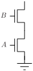
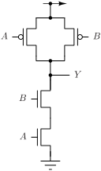
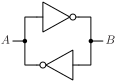
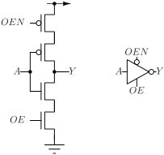
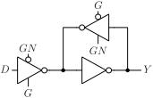
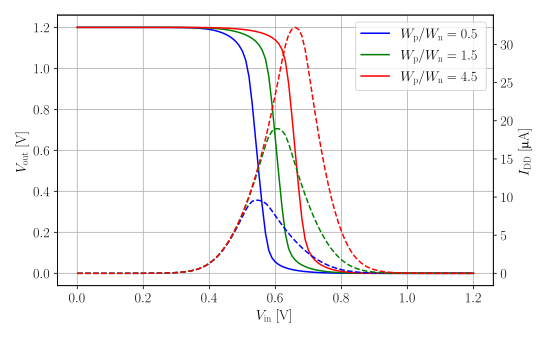
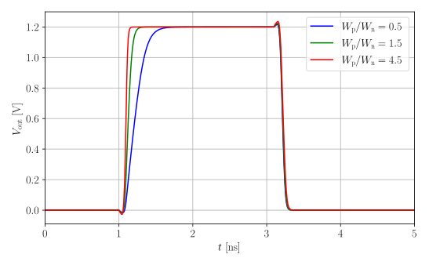
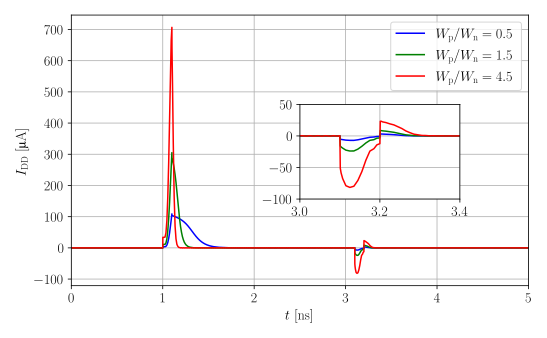

# Standard cell design

Standard digital cell library provides logical and physical views that are used in digital design flow to implement the chip functionality.
Ideally, standard cells should have minimum delay and power - both static and dynamic, while minimizing area and substrate noise injection.
It goes without saying that it is not possible to minimize delay/power/area/noise simultaneously, so a compromise must be made to optimize chosen metrics at the expense of others.

There are two types of standard digital cell libraries: pad ring and core.
- Pad ring cells are connected to chip bonding pads and are arranged into a continuous ring around chip core - hence the name pad ring cells. 
These cells are interface between chip core logic that operates at low voltage (e.g. 1.2 V for 130 nm CMOS) and I/O voltage (e.g. 1.8 or 3.3 V).
They also provide electrostatic discharge (ESD) protection of inputs, outputs and power pins.
- Core cells are used for implementing digital logic in the chip core, and they are usually referred to standard digital cells.

Different designs have different requirements, and there isn't a "one size fits all" standard cell digital library.
To address this issue, some foundries provide several variants (flavours) of standard digital cell libraries that are optimized for different criteria:

- General purpose (GP). GP cells are designed as a compromise of area/delay/power/noise performance, and are suitable for general purpose designs.
- High density (HD). HD cells are optimized for minimum area at expense of delay/power/noise performance. These cells usually don't have n-well/substrate ties to reduce the area, and require the use of special cells for biasing.
Few n-well/substrate ties results in higher substrate noise injection, that could be a problem in mixed-signal designs.
- High performance (HP). Cells are optimized for minimum delay at expense of area/power/noise performance. Area is increased because high performance cells usually contain n-well and substrate ties to pick up charge injected into substrate due to high slew rate and current switching. HP cells can use transistors with lower threshold voltage (low-Vt) to increase the current drive and reduce gate propagation delay. Dynamic power is increased due to higher drive current and operating frequency, but static power is increased as well due to increased leakage of low-Vt transistors. 
- Low noise (LN). Cells are optimized to minimize substrate noise injection. Low noise cells contain n-well and substrate ties connected to a separate rails to minimize substrate noise injection.
- Junction isolated (JI). Junction isolated cells use triple wells to isolate the digital circuits from substrate. JI cells minimize the substrate noise injection.
- Low leakage (LL). Low leakage cells use hight threshold voltage (high-Vt) transistors to minimize leakage current of transistors in off state, and consequently static power.

Regardless of flavour of standard cell library, it consists of several standard cell types:
- Core logic. These cells implement various Boolean functions and memory elements (flip-flops and latches) in variety of drive strengths. Constant '1', called "tie high", and constant '0', called "tie low", cells should be included to avoid connecting transistor gates directly to power and ground.
- Scan chain cells. These cells are used to insert a Design for Test (DFT) scan chain during synthesis. Scan chains are used in automated factory testing to screen for defect chips early.
- Physical cells. These cells do not implement logic, but are needed for physical implementation. Standard cells that do not have integrated n-well and substrate ties require regular placement of special cells that tie n-well to power supply and substrate to ground. Core utilization is never 100%, and filler cells need to be inserted in unplaced sites to connect power and ground rails. Besides connecting the power and ground rails, filler cells also ensure that minimum density of polysilicon and diffusion is met. Alternatively, a cell with capacitor between power and ground can be inserted to provide local power decoupling. Care should be taken when inserting decoupling cells as they are implemented as MOS capacitors that can increase static power due to gate oxide leakage. Some standard cells require placement of special cells at the edges and corners of cell array to satisfy design rules, that are called "end cap" and "corner cap" cells. Finally, "antenna cells" are used to fix antenna DRC errors that occur for large ratio of metal to gate area.

Standard cells should be compact, routed with minimum number of layers - usually only in diffusion, polysilicon and metal 1, so that maximum number metals can be used for routing. 
Cells in advanced nodes might use more than one metal layer to reduce the cell area, but this is offset by large number of available metal layers.

Digital implementation floor planner tool places standard cells in a regular array, as shown in the figure below.
Array rows are separated by alternating horizontal power (VDD) and ground (GND) rails.
Standard cells are Y mirrored in alternating rows to properly connect the power and ground, as is indicated by the orientation mark.


Router uses pre-defined set of metal track widths and vias (also called "cuts" in a digital flow) for routing. Information about cell geometry and routing is contained in a technology LEF file, that is an integral part of a standard digital library.

## Anatomy of a standard cell

For a cell library to be usable in an automated digital implementation flow, it must conform to some rules:
- Cells must have the same height so that they can be placed in rows.
- Cell width must be an integer multiple of unit cell width.
- Cells must have power and ground rails that can be connected by abutment.
- Cells must conform to DRC rules, even when abutted to any other cell in any valid X/Y mirror condition.
- Cell pins must be on a routing grid and accessible by via without DRC violations.

A standard cell site template shown in the figure below can solve most of the standard cell requirements. 


Standard cell site template provides:
- Place and Route (PnR) boundary for cell alignment and abutment. Cell layout extends beyond PnR boundary, and when cells are abutted from left, right, top and bottom some parts of layouts overlap. For example, abutting a cell from top or bottom results in overlap of power rails, diffusions and contacts, but the composite layout is still DRC clean.
- Power and ground rails in metal 1.
- N-well for PMOS transistors. Height of n-well is chosen to reflect the different widths of NMOS and PMOS transistors due to different hole and electron mobilities.
- N-well and substrate ties, that include diffusion, P and N implants and contacts to metal 1. Contacts to diffusions are arranged on a grid so they are aligned with cells from rows above and below.
- Height of all cells is guaranteed to be the same, and cell width is always an integer multiple of a unit cell width. Cells have half of unit width on left and right sides to allow seamless abutment of standard cells.
- Routing grid markings, shown in red dashed lines, to explicitly show routing tracks and possible pin placements.
- General keep out areas on the left and right sides of a cell are sized so that minimum spacing rules are satisfied in all cases.
When cells are abutted, keep out areas of adjoining cells are joined, so the width of two keep out areas should be equal to largest minimum spacing rule of layers used in a standard cell. Layout of standard cells uses only diffusion, polysilicon and metal 1, so the width of keep out area is  
`keepout_w = 0.5 * max(min_spacing(diffusion), min_spacing(polysilicon), min_spacing(metal_1))`  
In the case of [IHP SG13G2 process design rules](https://github.com/IHP-GmbH/IHP-Open-PDK/blob/main/ihp-sg13g2/libs.doc/doc/SG13G2_os_layout_rules.pdf) minimum dimensions are
    | Layer       | Minimum spacing |
    |-------------|-----------------|
    | Diffusion   | 210 nm          |
    | Polysilicon | 180 nm          |
    | Metal 1     | 180 nm          |
    | Keep out    | 105 nm          |
- Channel keep out area is determined by DRC rule that sets minimum distance of NMOS transistor channel to n-well and minimum n-well enclosure of PMOS transistor channel. For [IHP SG13G2 process design rules](https://github.com/IHP-GmbH/IHP-Open-PDK/blob/main/ihp-sg13g2/libs.doc/doc/SG13G2_os_layout_rules.pdf) minimum channel keep out distance from n-well edge is determined by rules NW.c and NW.d, and is 310 nm, for a total of 620 nm channel keep out area height.

Standard cell site template can speed up the development of layouts as physical constraints are marked, as well as pin positions. The only thing that remains is to define the unit site size.
Unit site height is traditionally "measured" in the number of horizontal metal tracks that can be routed over the height of a cell - usually 7 metal tracks for high density cell, and 9 or 11 tracks for general purpose and high performance cells, while the width is determined by vertical metal track pitch.

Metal track pitch is constrained by minimum metal width and spacing, although other factors such as design for manufacturability (DFM) or better track utilization may affect the decision on track pitch.
On a first glance, horizontal and vertical track pitch should be the same because it is common that metals used in digital implementation have the same minimum width and spacing.
Metal 1 is an exception and usually has smaller minimum width and spacing to allow more compact routing in standard cells.

In SG13G2 process minimum metal 2 to 5 width is 200 nm and minimum spacing is 210 nm. This results in theoretical minimum for track pitch of 410 nm. Open source IHP standard cell library uses 420 nm pitch for horizontal metals (M2 and M4) and 480 nm for vertical metals (M3 and M5).
Horizontal pitch of 420 nm, instead of minimum of 410 nm, can be attributed to relaxed spacing to increase the yield, but it does not explain why the vertical track pitch is 480 nm.
The reason for larger vertical track pitch is that via connected to metal has to have an endcap overhang (rule Mn.c1 requires 50 nm) that enlarges the metal width.
For a single via, that is usually used for routing digital designs, endcap overhang must be present on at least two sides, resulting in minimum track pitch of 200 + 210 + 50 = 460 nm, that is close to 480 nm used in IHP cells.
Such arrangement reserves space for endcaps only in one dimension, that might result in routing obstruction in dense designs.

GLOW SG13G2 standard cell library is designed to use the same routing pitch for both horizontal and vertical tracks of 480 nm, reserving space for endcaps in both dimensions.
Increasing the horizontal pitch from 420 to 480 nm results in 9 tracks cell height of 4.32 um instead of 3.78 um - about 15% increase in unit cell area.
This area is not wasted for several reasons (numbers for DRC rules are for IHP SG13G2 technology):
- Minimum spacing of well/substrate tie to transistor channel is 300 nm. Together with 150 nm of tap diffusion inside the PnR area results in minium of 450 nm spacing of transistor channel from PnR vertical boundary. Including 620 nm of channel keep out area near n-well edge, it results in 1520 nm of cell height that cannot be used for transistor gates. Nine track cell with horizontal pitch of 420 nm has a total height of 3.78 um, but transistor channels can only occupy height of 2.26 um, while the cell with 480 nm pitch has a total height of 4.32 um, where transistors can occupy height of 2.8 um - an increase of almost 24%. This increase should be understood as a potential for area reduction as 15% of cell area is traded for (potential) 24% increase in transistor area. Not all cells will benefit from space available for wider transistors, but many cells will, especially if transistor dimensions are chosen to maximize the use of available area.
- More space for routing of complex logic inside a standard cell, potentially reducing cell width and overall area.
- Flexibility of via endcaps in both horizontal and vertical tracks might reduce routing obstructions.

# Design of a standard cell

The following sections contain the design flow for a single standard cell.

## Netlist design

Standard digital logic cell design starts with functional design, followed by initial netlist design, transistor sizing and equivalent circuit transformations. Some iterations might be required when physical constrainst, such as routing and cell height, are taken into account.

Static CMOS logic gates can be partitioned into pull-up network (PUN) consisting of PMOS transistors, and pull-down network (PUD) consisting of NMOS transistors, as shown in the figure below. PUN is active when the output should be driven to logic '1', and the PUD is active when the output should be driven to logic '0'.
By 'network is active' we mean that there is a (relatively) low resistance path of turned-on transistors from power (ground) to the output that pulls the output, by charging the capacitance connected to output, to logic '1' ('0').
PUN and PUD should never, except in short transients when inputs change, be active at the same time because it would result in a short circuit between power supply and ground.
<div align="center">

</div>
The condition that PUN and PUD should not be active at the same time requires that they are complementary.
From a functional perspective, only PUN or PUD should be designed, as the other network is it's complementary.
Making a complementary network is simple as series trasistor connections becomes a parallel connection in a complementary network, and vice-versa.

| A  |  B  | NAND(A,B) |
|:--:|:---:|:---------:|
| 0  |  0  |    1      |
| 0  |  1  |    1      |
| 1  |  0  |    1      |
| 1  |  1  |    0      |

PUN is active for three input value when ouput is logic '1', while the PDN is active only for `A=1, B=1` when ouptut is logic '0'.
In this case it is easier to design the PDN, as it is active for only one input value, and it is a series connection of two NMOS transistors as shown in the figure below.
Only when both NMOS transistors are turned on with input value `A=1, B=1` the output is pulled low, in accordance with the NAND truth table.
<div align="center">

</div>
Complementary network for PUN network is obtained by transforming a series connection of NMOS transistors to parallel connection of PMOS transistors. Complete schematic of NAND gate is given in the figure below.
<div align="center">

</div>
Any static CMOS combinatorial network with one output can be made by designing PUN or PDN directly from the truth table, and then making a complimentary network by parallel <-> series conversion.
It is easier to design a PUN/PDN network that has a smaller number of elements, so it is common to inspect the truth table and then design PUN if there are fewer 1's in the output values, or PDN if there are fewer 0's.
Design of combinatorial circuits with multiple outputs might be more involved as there is a possibility to reuse common terms and reduce the total number of transistors and layout area.

Memory elements, such a latches and flip-flops, in static CMOS are based on two inverters connected back-to-back, as shown in the figure below.
<div align="center">

</div>

Back-to-back inverters, also known as two inverter latch or a bistable element, form a positive feedback loop that indefinitely retains one of two possible stable states - logic '1' or '0'. The state of a latch can be changed by forcing the output of inverter `A` or `B` by an external tristate driver. In normal operation the tristate driver's output would be in high impedance state, and the output would only be activated when a state needs to be changed.
Inverter with tristate output, shown in the figure below, can be used as an external driver.
Output of a tristate inverter is high impedance `Y=Z` when `OE=0` and `OEN=1`, and `Y=NOT(A)` when `OE=1` and `OEN=0`.

<div align="center">

</div>

One of the inverters can be made to be 'weak' by using close to minimum width transistors. 'Weak' inverter output can easily be forced to change the value by an external tristate driver. Alternatively, one of the inverters can have a tristate output.
Using a tristate driver and tristate inverter in a feedback loop results in a transprarent latch, shown in the figure below.
Signals `G` and `GN` determine whether the latch passes the input data value to the output - latch is 'transparent', or keeps the output at latched value. In the figure below the latch is transparent for `G=1` and `GN=0`, when the tristate inverter connected to the input `D` is active and feedback tristate inverter is in high impedace state, effectively cutting the feedback loop.
The data value is latched when control signals transition to `G=1 -> G=0` and `GN=0 -> GN=1`. This transition puts the tristate inverter in high impedance state, so it is no longer driving the bistable element, and enables the tristate inverter in the feedback loop that indefinitely retains the last input value.

<div align="center">

</div>

Flip-flops are usually made from two latches in so-called 'master-slave' configuration. The principle of operation is the same, with a difference that a flip-flop captures the input data on rising or falling edge of the clock signal and retains it, regardless of data and clock signal levels, until the next rising or falling edge.

From these simple examples we can see that complex gates are made from simpler ones, and that some basic circuits could be reused. That is the reason why parametrized circuits, located in `glow_parcells`, are made.

Up until now we were considering only the functional requirements - which circuit topology implements the desired combinatorial function, or how to make a memory element. For a circuit to be implemented we need to determine the transistor dimensions - channel length and width - for all transistors.
This is called 'transistor sizing' and is an important step in the design of a standard digital cell.

Transistor channel length should be the minimum channel length available in a given technology - if a longer channel length produces satisfactory results, a different and cheaper technology should be considered. 
Using the minimum channel length ensures that input capacitance, propagation delays and area are minimal for a given technology.
If static leakage is a concern, it is better to use transistors with higher threshold voltage or to lower the power supply voltage, than to use transistors with longer channel.
The only exception to this 'rule' are special delay cells that are used to fix hold time violations, which intentionally have long propagation times.

Choice of transistor widths in a standard cell comes down to the choice of ratio of PMOS to NMOS transistor width, and the width of NMOS transistors in various stages. The width of NMOS transistors determines the drive strength of a cell, and it can be considered as an independent variable available to design cells of different drive strengths. Besides electrical performance, there are physical constraints, such as available area and foundry design rules.

The choice of PMOS to NMOS ratio is mainly technology dependent, but some fine tuning may result from design requirements. In older CMOS processes, where minimum channel length was measured in micrometers, the mobility of holes was about two times lower than the mobility of electrons, so the default ratio of PMOS to NMOS transistor width for an inverter was about two. 
Having the PMOS to NMOS width equal to electron to hole mobility results in, in a first approximation, that 'on' resistance at the output is equal for charging the parasitic capacitance to power supply and discharging it to ground.
In deep submicron processes the ratio of electron to hole mobility has reduced below the value of two, and is about 1.5 in 130 nm process.

Overall goals of the standard cell design is to:
- minimize the cell area, 
- minimize the internal cell power,
- minimize the propagation delay and rise/fall times,
- balance propagation delays and rise/fall times,
- make the switching threshold close to half of power supply.

There is no point of designing a cell that has very short low to high and long high to low propagation delay, as the longer propagation delay will limit the maximum operating frequency. Similar reasoning applies to rise/fall time as longer time will determine the maximum operating frequency.
Also, switching threshold at half the power supply maximizes the noise immunity.

Lets consider an inverter as a simple example to illustrate the process of choosing the PMOS to NMOS ratio. We will fix the NMOS width to 1 micrometer and observe the effects of different PMOS/NMOS ratios.
Three inverters were designed with PMOS to NMOS channel width WP/WN of 0.5, 1.5 and 4.5 to illustrate the effects of transistor sizing.

All three inverters were simulated with `ngspice` in a DC simulation using SG13G2 transistor models `sg13_lv_nmos` and `sg13_lv_pmos`.
Input voltage was swept from 0 to a power supply of 1.2 V, and output voltages and supply currents were recorded, and the results are presented in the figure below.
Solid lines represent output voltage, while the dashed lines are current through the power supply.

<div align="center">

</div>

From simulation results it can be seen that WP/WN of 1.5 has an input threshold close to half the power supply, which maximizes the noise immunity.
However, DC simulation does not reveal all parameters of interest.
Results of transient simulation with output load of 20 fF and input rise/fall time of 100 ps are shown in the figure below.
Having in mind that the width of NMOS transistors is fixed, falling transition is almost the same, while the rising transition is different due to different PMOS widths.
Numerical values of transient simulations are summarized in the table following the figure.

<div align="center">

</div>

| WP/WN | tr   | tf   | tphl | tplh |
|:-----:|:----:|:----:|:----:|:----:|
| 0.5   | 187.7| 47.6 | 64.0 | 166.3|
| 1.5   | 67.4 | 48.7 | 66.7 | 76.7 |
| 4.5   | 32.5 | 52.5 | 73.5 | 46.2 |

As expected, fall times and propagation delays high to low, that are mostly determined by the NMOS transistor, are almost the same.
However, rise time and low to high propagation delays are quite different, that is also expected.
Ratio of PMOS to NMOS transistors of 1.5 has balanced rise/fall times and propagation delays, although a ratio of 4.5 might seem a viable choice as well, that offers a margin in rise time and propagation delay.
However, inspecting the power supply current, shown in the figure below, provides an additional insight.

<div align="center">

</div>

At about 1 ns, when the PMOS transistor charges the output capacitance, the maximum value of power supply current is much higher for larger PMOS transistor, but that is expected as the output capacitance is charged faster. At falling transition, the output capacitance is discharged through the NMOS transistor, and the current flowing through the power supply is the VDD-GND short circuit current that represents the cell internal power, and should be minimized.
Short circuit current for PMOS/NMOS ratio of 4.5 is much higher than for ratio of 1.5, and it indicates that the penalty in internal power is not worth the (unnecessary) margin in rise time/propagation delay.

Transistor sizing for complex gates is a bit more involved as propagation delays and rise/fall times are input-data dependant. Technically speaking, complex gates have several timing arcs that need to be considered and balanced.
Initial sizing can be obtained by reusing the inverter transistor widths and sizing the transistors to keep the 'on' resistance approximately constant. If needed, fine tuning can be performed after initial sizing.

Assuming that an inverter has PMOS channel width `WP` and NMOS channel width `WN`, we will show how to size transistors of two input NAND gate, that is repeated in the figure below for easy reference.

<div align="center">

</div>

Both PMOS transistors are connected directly to power supply and output, and using the same transistor width as in inverter will result in the same 'on' resistance when only one of the PMOS transistors is turned on.
When both of the transistors are turned on the 'on' resistance will be reduced to half the value.
Transistors should be sized so that 'on' resistance is the same as inverter's in the worst case, so PMOS transistors should have channel width equal to inverter's `WP`.

Output is pulled low only when both NMOS transistors are turned on, and the equivalent 'on' resistance of two transistors in series is double the resistance of a single transistor. Therefore, NMOS transistors should have channel width of `2WN` to maintain the same 'on' resistance as inverter.

The result of this short analysis is that initial values of PMOS and NMOS channel width for two input NAND gate are `WP` and `2*WN`, respectively. If needed, these values could be fine tuned or slightly changed to take into account physical constraints.

## Code organization

Standard cells are located in `$GLOW_ROOT/cells` directory, each within its own directory, as shown in the directory tree below.
```
├── cells_logic.txt
├── cells_physical.txt
├── DFQQN_D1
│   └── DFQQN_D1.py
├── DLN_D1
│   └── DLN_D1.py
├── INV_D1
│   └── INV_D1.py
└── NAND2_D1
    └── NAND2_D1.py
```
Files `cells_logic.txt` and `cells_physical.txt` contain a list of cells for batch processing, to separate the cells implementing logic from cells that are only needed for physical implementation - fillers, decoupling, etc.

Each cell is within its own directory, where all the generated files, such as SPICE and CDL netlists, will be placed.
Directory, Python file and cell name should all be the same, except for .py extension, to enable batch processing.

Classes from `glow_utils` should be used to construct the cell from NMOS and PMOS transistors, as shown in the `INV_D1` example below.

```python
from glow_parcells import *
from glow_utils.symsim import Symsim
from glow_utils.symtech import SymTech
from sympy import Not
from sympy.abc import x

def info():
    """
    Returns a dictionary with cell information
    Key         Value
    name        Cell name
    pinList     List of cell pins
    description Cell description
    """
    cellInfo = { 'name' : 'INV_D1',
                 'pinList' : ['A', 'Y', 'VDD', 'VSS'],
                 'description' : 'Inverter with drive strength x1'
    }
    return cellInfo

def generate(genFlat = True, anonimize = True):
    """
    Generate the circuit structure.
    If genFlat = True generate a flat circuit with suffix _flat
    If anonimize = True anonimize devices and nodes in the generated flat circuit
    """
    cellInfo = info()
    wn = SymTech.technology['invx1WN']
    wp = SymTech.technology['invx1WP']

    INV_D1 = Symsubcircuit(cellInfo['name'], cellInfo['pinList'])
    inv1 = inv_par('inv1', ['A', 'Y', 'VDD', 'VSS'], {'WN' : wn, 'WP' : wp})
    INV_D1.addElement(inv1)

    # Flatten the circuit
    if genFlat:
        INV_D1_flat = INV_D1.flat()
    if anonimize:
        INV_D1_flat.anonimize()

def check(verbose = False):
    """
    Check if the circuit works as expected
    """
    expectedFns = [ Not(x) ]
    cellInfo = info()
    name = cellInfo["name"]
    allCircuits = Symsubcircuit.getSubckts()
    circuit = allCircuits[ name + "_flat" ]
    sim = Symsim(circuit, verbose = verbose)
    return sim.combCheck(expectedFns)
```

Cell Python code is dynamically loaded by the `gencell` script that generates SPICE and CDL netlists, and performs checks to ensure that the cell performs as expected.

Function `info` returns a dictionary `cellInfo` that at least contains keys `name`, `pinList` and `description`.
Value of `name` is the cell name, `pinList` has list of cell top level pins (terminals) and `description` is string that describes the cell.
Other information might be included in a dictionary if it would be used in the flow.

Function `generate` assembles the circuit by creating an instance of `Symsubcircuit` class and adds transistors or other subcircuits to it. In this particular example, the inverter is made by instantiating a parametrized inverter circuit `inv_par` and passing the transistor dimensions obtained from `Symtech` class.
If `genFlat` is `True` the circuit is flattened, and if `anonimize` is True instance and node names are anonimized.

Function `check` uses `Symsim` class to simulate the circuit and check if its function matches the expected function. Any additional checks should be performed in this function, and return a value of `True` if cell works as intended.

Presented code organization allow for the use of tools from `glow_utils` to develop and check individual cells, but also to run batch processing scripts.

## Layout design and verification


## Cell characterization


## Abstract view generation


